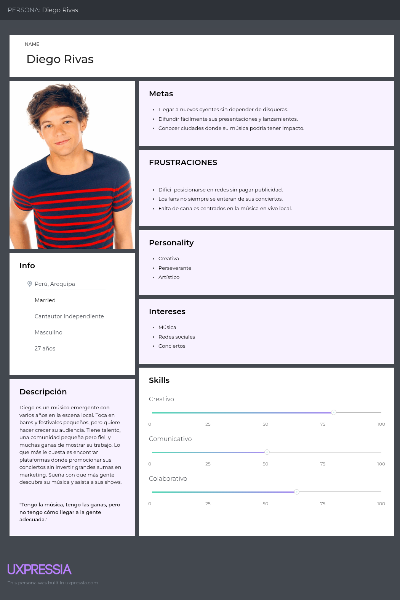
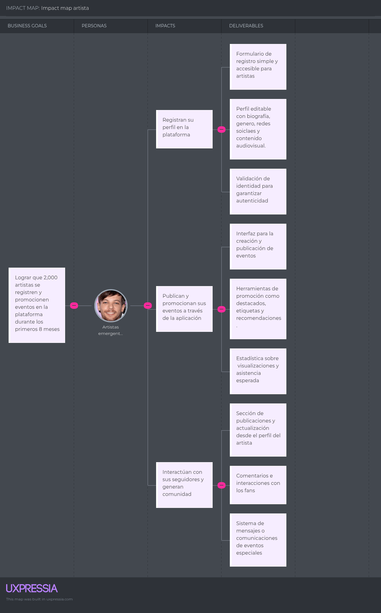

	
  
## Universidad Peruana de Ciencias Aplicadas

## TB1 "StayMap"

**1ASI0729 - DESARROLLO DE APLICACIONES OPEN SOURCE**

Carrera de Ingeniería de Software

**NRC:** 2510-4334

**Profesor:** Hugo Allan Mori Paiva

**Integrantes:**

Collantes Carrillo, Diego Mateo (u202311823)

Lizarbe Alvarez, Ariana Nickole (u202311704)

Ortiz Cardenas, Johanna Antuanete (u202310358)

Zegarra Lopez, Renato Sebastian Rubber (u202311558)

Zúñiga Murillo, Diego Sebastian (u202310636)

**2025**

## Registro de Versiones del Informe

<table>
  <thead>
    <tr>
      <th>Versión</th>
      <th>Fecha</th>
      <th>Autor</th>
      <th>Descripción de modificación</th>
    </tr>
  </thead>
  <tbody>
    <tr>
      <td>TB1</td>
      <td></td>
      <td></td>
      <td></td>
    </tr>
    <tr>
      <td>TP</td>
      <td></td>
      <td></td>
      <td></td>
    </tr>
    <tr>
      <td>TB2</td>
      <td></td>
      <td></td>
      <td></td>
    </tr>
    <tr>
      <td>TF</td>
      <td></td>
      <td></td>
      <td></td>
    </tr>
  </tbody>
</table>

## Contents

- [STUDENT OUTCOME](#student-outcome)
- [Project Report Collaboration Insights](#project-report-collaboration-insights)

- [CAPÍTULO I: INTRODUCCIÓN](#capítulo-i-introducción)
  - [1.1. Startup Profile](#11-startup-profile)
    - [1.1.1. Descripción de la Startup](#111-descripción-de-la-startup)
    - [1.1.2. Perfiles de integrantes del equipo](#112-perfiles-de-integrantes-del-equipo)
  - [1.2. Solution Profile](#12-solution-profile)
    - [1.2.1. Antecedentes y problemática](#121-antecedentes-y-problemática)
    - [1.2.2. Lean UX Process](#122-lean-ux-process)
      - [1.2.2.1. Lean UX Problem Statements](#1221-lean-ux-problem-statements)
      - [1.2.2.2. Lean UX Assumptions](#1222-lean-ux-assumptions)
      - [1.2.2.3. Lean UX Hypothesis Statements](#1223-lean-ux-hypothesis-statements)
      - [1.2.2.4. Lean UX Canvas](#1224-lean-ux-canvas)
  - [1.3. Segmentos objetivo](#13-segmentos-objetivo)

- [Capítulo II: Requirements Elicitation & Analysis](#capítulo-ii-requirements-elicitation--analysis)
  - [2.1. Competidores](#21-competidores)
    - [2.1.1. Análisis competitivo](#211-análisis-competitivo)
    - [2.1.2. Estrategias y tácticas frente a competidores](#212-estrategias-y-tácticas-frente-a-competidores)
  - [2.2. Entrevistas](#22-entrevistas)
    - [2.2.1. Diseño de entrevistas](#221-diseño-de-entrevistas)
    - [2.2.2. Registro de entrevistas](#222-registro-de-entrevistas)
    - [2.2.3. Análisis de entrevistas](#223-análisis-de-entrevistas)
  - [2.3. Needfinding](#23-needfinding)
    - [2.3.1. User Personas](#231-user-personas)
    - [2.3.2. User Task Matrix](#232-user-task-matrix)
    - [2.3.3. User Journey Mapping](#233-user-journey-mapping)
    - [2.3.4. Empathy Mapping](#234-empathy-mapping)
    - [2.3.5. As-is Scenario Mapping](#235-as-is-scenario-mapping)
  - [2.4. Ubiquitous Language](#24-ubiquitous-language)

- [Capítulo III: Requirements Specification](#capítulo-iii-requirements-specification)
  - [3.1. To-Be Scenario Mapping](#31-to-be-scenario-mapping)
  - [3.2. User Stories](#32-user-stories)
  - [3.3. Impact Mapping](#33-impact-mapping)
  - [3.4. Product Backlog](#34-product-backlog)

- [Capítulo IV: Product Design](#capítulo-iv-product-design)
  - [4.1. Style Guidelines](#41-style-guidelines)
    - [4.1.1. General Style Guidelines](#411-general-style-guidelines)
    - [4.1.2. Web Style Guidelines](#412-web-style-guidelines)
  - [4.2. Information Architecture](#42-information-architecture)
    - [4.2.1. Organization Systems](#421-organization-systems)
    - [4.2.2. Labeling Systems](#422-labeling-systems)
    - [4.2.3. SEO Tags and Meta Tags](#423-seo-tags-and-meta-tags)
    - [4.2.4. Searching Systems](#424-searching-systems)
    - [4.2.5. Navigation Systems](#425-navigation-systems)
  - [4.3. Landing Page UI Design](#43-landing-page-ui-design)
    - [4.3.1. Landing Page Wireframe](#431-landing-page-wireframe)
    - [4.3.2. Landing Page Mock-up](#432-landing-page-mock-up)
  - [4.4. Web Applications UX/UI Design](#44-web-applications-uxui-design)
    - [4.4.1. Web Applications Wireframes](#441-web-applications-wireframes)
    - [4.4.2. Web Applications Wireflow Diagrams](#442-web-applications-wireflow-diagrams)
    - [4.4.3. Web Applications Mock-ups](#443-web-applications-mock-ups)
    - [4.4.4. Web Applications User Flow Diagrams](#444-web-applications-user-flow-diagrams)
  - [4.5. Web Applications Prototyping](#45-web-applications-prototyping)
  - [4.6. Domain-Driven Software Architecture](#46-domain-driven-software-architecture)
    - [4.6.1. Software Architecture Context Diagram](#461-software-architecture-context-diagram)
    - [4.6.2. Software Architecture Container Diagrams](#462-software-architecture-container-diagrams)
    - [4.6.3. Software Architecture Components Diagrams](#463-software-architecture-components-diagrams)
  - [4.7. Software Object-Oriented Design](#47-software-object-oriented-design)
    - [4.7.1. Class Diagrams](#471-class-diagrams)
    - [4.7.2. Class Dictionary](#472-class-dictionary)
  - [4.8. Database Design](#48-database-design)
    - [4.8.1. Database Diagram](#481-database-diagram)

- [Capítulo V: Product Implementation, Validation & Deployment](#capítulo-v-product-implementation-validation--deployment)
  - [5.1. Software Configuration Management](#51-software-configuration-management)
    - [5.1.1. Software Development Environment Configuration](#511-software-development-environment-configuration)
    - [5.1.2. Source Code Management](#512-source-code-management)
    - [5.1.3. Source Code Style Guide & Conventions](#513-source-code-style-guide--conventions)
    - [5.1.4. Software Deployment Configuration](#514-software-deployment-configuration)
  - [5.2. Landing Page, Services & Applications Implementation]((#52-landing-page-services--applications-implementation)
    - [5.2.1. Sprint 1](#521-sprint-1)
      	- [5.2.1.1. Sprint Planning 1](#5211-sprint-planning-1)
	- [5.2.1.2. Aspect Leaders and Collaborators](#5212-aspect-leaders-and-collaborators)
	- [5.2.1.3. Sprint Backlog 1](#5213-sprint-backlog-1)
	- [5.2.1.4. Development Evidence for Sprint Review](#5214-development-evidence-for-sprint-review)
	- [5.2.1.5. Execution Evidence for Sprint Review](#5215-execution-evidence-for-sprint-review)
	- [5.2.1.6. Software Deployment Evidence for Sprint Review](#5217-software-deployment-evidence-for-sprint-review)
	- [5.2.1.7. Team Collaboration Insights during Sprint](#5218-team-collaboration-insights-during-sprint)
- [Conclusiones](#conclusiones)
- [Bibliografía](#bibliografía)
- [Anexos](#anexos)

## STUDENT OUTCOME
ABET - EAC - Student Outcome 3: Capacidad de comunicarse efectivamente con un rango de audiencias. En el siguiente cuadro se describen las acciones realizadas y enunciados de conclusiones por parte del grupo, que permiten sustentar el haber alcanzado el logro.

<table>
  <thead>
    <tr>
      <th>Criterio específico</th>
      <th>Acciones realizadas</th>
      <th>Conclusiones</th>
    </tr>
  </thead>
<tbody>
    <tr>
      <td>Comunica oralmente con efectividad a diferentes rangos de audiencia</td>
      <td></td>
      <td></td>
    </tr>
    <tr>
      <td>Comunica por escrito con efectividad a diferentes rangos de audiencia</td>
      <td></td>
      <td></td>
    </tr>
    </tbody>
</table>

# CAPÍTULO I: INTRODUCCIÓN

# 1.1. Startup Profile

## 1.1.1. Descripción de la Startup
The Rumbling es una startup creativa y tecnológica comprometida con transformar la manera en que las personas descubren, conectan y viven la música en vivo. Creemos que cada concierto, sin importar su tamaño, tiene el poder de generar emociones únicas y crear vínculos duraderos entre artistas y fans. Por ello, trabajamos en soluciones digitales innovadoras que conectan al público con experiencias musicales auténticas y accesibles.
Nos enfocamos en el desarrollo de StayMap, una aplicación web interactiva que actúa como un puente entre los amantes de la música y los escenarios de su ciudad. A través de un mapa dinámico con geolocalización, los usuarios pueden explorar eventos en tiempo real, seguir a sus artistas favoritos, conocer las fechas de sus giras, hacer check-in en conciertos y compartir momentos con otros fans. Además, brindamos herramientas de promoción y visibilidad para bandas emergentes, contribuyendo activamente al crecimiento de la escena musical independiente.
En The Rumbling, apostamos por el poder de la comunidad, el descubrimiento espontáneo y la tecnología como medio para enriquecer las experiencias culturales. Nuestra visión es construir una red global donde cada presentación en vivo —desde un bar local hasta un festival internacional— pueda ser descubierta, compartida y vivida al máximo, celebrando la diversidad y el dinamismo del mundo musical.
Con pasión, creatividad y enfoque social, desde el corazón de The Rumbling impulsamos proyectos como StayMap, que reimaginan el futuro de la música en vivo y lo acercan a quienes más lo disfrutan.

## 1.1.2. Perfiles de integrantes del equipo

<table>
  <thead>
    <tr>
      <th>Estudiante</th>
      <th>Descripción</th>
    </tr>
  </thead>
  <tbody>
    <tr>
      <td>Collantes Carrillo, Diego Mateo (u202311823)</td>
      <td>Mi nombre es Diego Collantes. Tengo 19 años. Soy estudiante de quinto ciclo en la Universidad Peruana de Ciencias Aplicadas (UPC). Disfruto de leer, redactar y escuchar música en mi tiempo libre. Elegí esta carrera, ya que me interesó todo el proceso que hay detrás de cada aplicación o programa que usamos en nuestro día a día. Personalmente, espero ampliar mis conocimientos en este ámbito a lo largo de este curso. Además, estoy comprometido a contribuir en todo lo que sea posible con el equipo y a desempeñarme de manera adecuada.
</td>
    </tr>
    <tr>
       <td>Lizarbe Alvarez, Ariana Nickole (u202311704)</td>
      <td>Mi nombre es Ariana Lizarbe, tengo 19 años y estoy cursando el cuarto ciclo de la carrera de ingeniería de software en la Universidad Peruana de Ciencias Aplicadas. En mi tiempo libre fuera de la universidad, procuro mejorar mis habilidades blandas, como la empatía o inteligencia emocional. También, me esfuerzo en adquirir conocimientos que pueden ayudarme a desarrollarme como futura profesional, como distintos lenguajes de programación. A su vez, disfruto de escuchar música, podcasts, leer y ver series de televisión. Me comprometo a colaborar de manera activa y responsable en la creación de esta startup, aportando mis habilidades en pensamiento crítico, trabajo en equipo y adaptabilidad para alcanzar un trabajo de calidad sobresaliente.
</td>
    </tr>
    <tr>
      <td>Ortiz Cardenas, Johanna Antuanete (u202310358)</td>
      <td>Mi nombre es Johanna Antuanete Ortiz Cárdenas, tengo 18 años y me encuentro en el quinto ciclo de la carrera de Ingeniería de Software. Me considero una persona proactiva y responsable, siempre buscando que mis trabajos sean de la mejor calidad posible. Me apasiona investigar sobre tecnología, lo que me permite estar al tanto de las últimas novedades y tendencias. En mi tiempo libre, disfruto jugar videojuegos, escuchar música y leer cómics. En el presente proyecto grupal, me comprometo a colaborar de manera activa, aportando ideas y siendo puntual con los entregables para garantizar resultados sobresalientes.
</td>
    </tr>
    <tr>
      <td>Zegarra Lopez, Renato Sebastian Rubber (u202311558)</td>
      <td>Mi nombre es Renato Zegarra, tengo 19 años y actualmente estoy cursando la carrera de Ingeniería de Sistemas de Información en la Universidad Peruana de Ciencias Aplicadas. Fuera de mis estudios, disfruto explorar mis intereses en música, videojuegos y tecnología, siempre buscando nuevas formas de integrar estas pasiones en mi vida cotidiana. Me comprometo a colaborar de manera activa y responsable en la elaboración de este documento y en la concreción de la idea propuesta, aportando mis habilidades en análisis, creatividad y adaptabilidad. Estoy convencido de que con esfuerzo y trabajo en equipo, podemos alcanzar resultados innovadores y de alta calidad.
</td>
    </tr>
    <tr>
       <td>Zúñiga Murillo, Diego Sebastian (u202310636)</td>
      <td>Mi nombre es Diego Sebastián Zúñiga Murillo, tengo 20 años y actualmente curso el quinto ciclo de la carrera de Ingeniería de Software en la Universidad Peruana de Ciencias Aplicadas. Me considero una persona puntual, participativa y responsable, con una fuerte pasión por la tecnología y el aprendizaje constante.
En mi tiempo libre disfruto de escuchar música, lo que me ayuda a relajarme y mantener el equilibrio entre mis estudios y mi vida personal. Como estudiante, me comprometo a aportar activamente en el desarrollo de este proyecto, contribuyendo con creatividad, iniciativa y habilidades de liderazgo.
Confío en que, trabajando en equipo y manteniendo una comunicación constante, lograremos resultados destacados que reflejan nuestro esfuerzo y compromiso.
</td>
    </tr>
  </tbody>
</table>

# 1.2 Solution Profile
## 1.2.1. Antecedentes y problemática
**What**:

Las personas tienen dificultades para descubrir y conectarse con conciertos en vivo, especialmente los de pequeña o mediana escala. Esto limita la visibilidad de artistas emergentes, dificulta el acceso a experiencias musicales auténticas y reduce el impacto de la música local en la vida diaria de los fans.

De acuerdo con Chartmetric (2023) en su informe “Year in music 2023: Part 1”, de los aproximadamente 710,000 nuevos artistas agregados a su plataforma en dicho año, solo el 0.1% logró ubicarse entre los 35,000 artistas más exitosos. Mientras tanto, el 99.9% se mantuvo en la categoría de "sin descubrir" o "en desarrollo". Estas cifras subrayan la abrumadora dificultad que enfrentan los nuevos talentos para destacarse en un mar de competencia feroz.

**When**:

Esta problemática suele presentarse en momentos en los que las personas están motivadas a vivir experiencias musicales, pero no cuentan con la información necesaria para hacerlo. Por ejemplo, puede ocurrir cuando alguien decide salir de forma espontánea a un concierto una noche de fin de semana, pero no sabe dónde buscar eventos cercanos ni cuáles están activos en ese momento. También se da cuando un fan sigue a un artista emergente, pero no se entera de que este se presentará en su ciudad debido a la falta de difusión o herramientas para recibir notificaciones personalizadas. Otro escenario común es el de un turista que visita una nueva ciudad con ganas de explorar su vida cultural, pero al no conocer medios locales o redes de promoción independientes, termina perdiéndose eventos interesantes. Además, muchos conciertos organizados por bandas nuevas o independientes pasan desapercibidos porque no cuentan con canales efectivos para llegar a su público ideal, lo que limita tanto la asistencia como el crecimiento de la escena musical local. En todos estos casos, la desconexión entre el público y la música en vivo se traduce en oportunidades perdidas tanto para los fans como para los artistas.

**Where**:

Los problemas relacionados con el descubrimiento y la conexión con conciertos en vivo pueden surgir en diferentes espacios y contextos. Esto sucede tanto en el entorno cotidiano de las personas como en situaciones más específicas, como cuando visitan una nueva ciudad o buscan actividades culturales fuera de su rutina habitual. La desconexión entre los eventos musicales y el público puede ocurrir en calles con alta oferta artística pero poca visibilidad digital, en barrios donde se organizan conciertos independientes sin una estrategia de difusión clara, o incluso en ciudades donde los medios de promoción tradicionales no alcanzan a públicos más jóvenes o digitales.

StayMap se utiliza en diversos contextos urbanos y culturales para facilitar el acceso a experiencias musicales auténticas:

- En la ciudad de origen del usuario: Los usuarios acceden a la aplicación para descubrir conciertos cercanos en tiempo real, ya sea para planificar su fin de semana o salir de manera espontánea en busca de música en vivo.
- Durante viajes o turismo cultural: Al llegar a una nueva ciudad, los usuarios pueden explorar la agenda musical local sin depender de medios tradicionales o recomendaciones limitadas.
- En espacios donde la escena independiente tiene poca visibilidad: StayMap permite a los usuarios acceder a eventos organizados por artistas emergentes o colectivos culturales que normalmente no figuran en los canales de difusión masiva.

StayMap está diseñada para personas amantes de la música en vivo que desean explorar y disfrutar de conciertos con mayor facilidad, especialmente en escenarios donde la información no es fácilmente accesible o centralizada.

**Why**:

Porque la música en vivo tiene un valor emocional, social y cultural que va más allá del entretenimiento. Asistir a conciertos fortalece el sentido de comunidad, apoya directamente a los artistas y permite descubrir nuevas propuestas que muchas veces no llegan a los circuitos comerciales. Sin embargo, esta experiencia se ve limitada cuando no existe una herramienta efectiva que conecte al público con los eventos musicales a su alrededor, especialmente en el caso de conciertos independientes o espontáneos. La falta de difusión adecuada no solo perjudica a los músicos emergentes, sino también a los fans que anhelan vivir momentos auténticos y significativos a través de la música. En un mundo hiperconectado, resulta paradójico que aún sea tan difícil descubrir qué está ocurriendo musicalmente a nivel local, justo cuando las personas tienen la disposición, el tiempo o el ánimo de salir a explorar.

**Who**:

Esta problemática afecta principalmente a dos grupos:
- Fans de la música en vivo, tanto jóvenes como adultos, que desean descubrir conciertos interesantes cerca de ellos pero carecen de información actualizada, personalizada o centralizada.
- Artistas emergentes y bandas independientes, que enfrentan grandes barreras para visibilizar sus presentaciones en un entorno saturado y competitivo, sin contar con recursos o redes de difusión eficientes.

**How**:

StayMap aborda esta problemática mediante una aplicación móvil que centraliza, personaliza y geolocaliza la información sobre conciertos en vivo. Utilizando tecnología basada en ubicación y preferencias del usuario, StayMap permite:
- Descubrir eventos en tiempo real cerca de su ubicación.
- Filtrar por géneros, fechas y tipo de eventos.
- Recibir notificaciones personalizadas sobre conciertos de artistas favoritos o nuevos talentos similares.
- Acceder a eventos independientes que usualmente no aparecen en medios tradicionales.
- Compartir y recomendar eventos con amigos, generando una comunidad activa.

Esta solución integra datos de distintas fuentes, incluyendo registros de eventos, publicaciones de artistas y recomendaciones sociales, facilitando una experiencia fluida, espontánea y enriquecedora.

**How much:**

Las consecuencias de no atender esta problemática incluyen:
- Pérdida de oportunidades para artistas de darse a conocer, generar ingresos y construir una base de fans sólida.
- Reducción en la asistencia a conciertos, afectando la economía de espacios culturales, bares y promotores locales.
- Empobrecimiento de la vida cultural urbana, donde eventos valiosos pasan desapercibidos y la diversidad musical queda eclipsada.
- Frustración del público, que quiere vivir experiencias auténticas pero no encuentra cómo hacerlo fácilmente.

Al mismo tiempo, existe un alto potencial de impacto positivo: al facilitar la conexión entre público y música en vivo, se promueve la cultura local, se fomenta el descubrimiento musical y se apoya directamente al ecosistema artístico independiente.

## 1.2.2. Lean UX Process

### 1.2.2.1. Lean UX Problem Statements
Nuestros usuarios son personas amantes de la música en vivo, especialmente jóvenes, adultos y turistas culturales que valoran experiencias auténticas y desean conectarse con la escena musical local. Necesitan una forma de descubrir conciertos en vivo cercanos, en tiempo real y de manera personalizada, ya que actualmente muchos eventos, en especial los de pequeña o mediana escala, pasan desapercibidos por la falta de canales efectivos de difusión. Esto genera una desconexión entre el público y los artistas emergentes, limitando tanto la asistencia como el crecimiento de la escena musical independiente. Sabremos que este problema está resuelto cuando los usuarios usen StayMap para asistir a más conciertos, aumente la visibilidad de artistas independientes y se registre una alta interacción con funciones como la geolocalización, notificaciones y exploración de eventos.
Por ello, StayMap se compromete a desarrollar una plataforma accesible, intuitiva y centrada en el usuario que actúe como puente entre el público y la música en vivo. A través de herramientas inteligentes de descubrimiento, personalización y notificación, StayMap facilitará la conexión entre los fans y los artistas, fomentando una cultura musical más viva, diversa e inclusiva. El objetivo es empoderar tanto a quienes crean música como a quienes la disfrutan, construyendo una comunidad que valore, comparta y mantenga viva la experiencia de los conciertos en directo.

### 1.2.2.2. Lean UX Assumptions
Creemos que nuestros usuarios son personas jóvenes, adultos y turistas culturales que disfrutan de la música en vivo y valoran experiencias auténticas en su ciudad o durante sus viajes. Asumimos que estos usuarios tienen dificultades para descubrir conciertos de pequeña o mediana escala debido a la falta de canales de difusión efectivos, lo que les hace perderse eventos interesantes y limita su conexión con artistas emergentes. Pensamos que los usuarios valorarán una aplicación que les permita recibir notificaciones personalizadas, explorar conciertos cercanos en tiempo real y descubrir música local de forma sencilla y atractiva. Creemos que una solución efectiva debe ser intuitiva, centrada en la geolocalización, personalizable según los gustos musicales del usuario y capaz de visibilizar eventos independientes que normalmente no figuran en medios tradicionales.

**Assumptions Worksheet**

**¿Quién es el usuario?** 
- Usuarios que gustan de la música y desean descubrir nuevos sitios musicales.
- Artistas que desean compartir su música con la comunidad.

**¿Dónde encaja nuestro producto en su trabajo o vida?**
- StayMap será una herramienta esencial en el día a día de los usuarios, permitiéndoles tomar decisiones rápidas y seguras sobre a dónde ir.
- Puede utilizarse al planificar una salida, durante una caminata, mientras se viaja o simplemente para descubrir nuevos espacios alineados con su estilo de vida.
- Funcionará como una guía personalizada que acompaña al usuario constantemente, facilitando la exploración urbana y la conexión con experiencias que realmente le interesan.

**¿Qué problemas tiene nuestro producto?**
- Falta de información confiable y en tiempo real sobre la seguridad, ambiente o calidad de los lugares públicos.
- Inseguridad urbana o zonas desconocidas que pueden generar ansiedad al moverse sin una guía confiable.
- Escasez de soluciones intuitivas que integren datos, bienestar y mapas personalizados de forma sencilla para el usuario común.

**¿Cuándo y cómo es nuestro producto utilizado?**
- StayMap se usa cuando las personas están por salir y quieren conocer un nuevo lugar..
- A lo largo del día: durante el trabajo, caminatas, paseos, o al momento de organizar actividades personales.
- Disponible en móviles y web, debe ser intuitiva y accesible para usuarios con distintos niveles de experiencia tecnológica.

**¿Qué características son importantes?**
- Mapas interactivos y personalizados según los géneros musicales favoritos del usuario, mostrando eventos y conciertos en zonas cercanas.
- Información en tiempo real sobre afluencia estimada, accesibilidad y ambiente del evento, permitiendo una mejor planificación.
- Alertas contextuales sobre cambios relevantes en los conciertos (como hora, lugar o disponibilidad de entradas).
- Recomendaciones musicales basadas en gustos del usuario, historial de asistencia y ubicación actual.
- Sistema de perfiles personalizados para fans y artistas, con beneficios únicos según su rol en la comunidad.

  
**Objetivos**
- Facilitar el descubrimiento de eventos cercanos: Ayudar a los usuarios a encontrar conciertos y actividades musicales de forma personalizada y rápida.
- Impulsar la conexión entre fans y artistas: Crear una red activa donde los fans puedan seguir sus artistas favoritos, recibir alertas y acceder a beneficios exclusivos.
- Convertir la movilidad urbana en una experiencia musical enriquecedora: Transformar el modo en que los usuarios se mueven por la ciudad, conectando lugares con emociones, música y comunidad.
- Promover la participación activa en la escena local: Fomentar que los usuarios asistan a más eventos, descubran artistas emergentes y compartan sus experiencias.

**Alcances**

Asistencia personalizada en tiempo real
- Recomendaciones de conciertos y eventos musicales según los intereses, ubicación y estado de ánimo del usuario.
- Actualizaciones en vivo sobre afluencia, horarios y cambios importantes en los eventos.
- Mapas interactivos para encontrar eventos cercanos con rutas claras desde la ubicación actual.

Accesibilidad y usabilidad
- Interfaz sencilla, moderna e intuitiva para todo tipo de usuarios.
- Disponible en smartphones, tablets y computadoras, incluso con acceso limitado a internet en algunos casos.

Conexión con expertos y comunidad
- Espacio para recibir recomendaciones de expertos en musica o experiencias de otros usuarios.
- Comunidad que comparte tips y lugares seguros, con opción de valorar y comentar.

**Escalabilidad**
- Adaptable a distintas ciudades, regiones y culturas urbanas.
- Capacidad para expandirse globalmente, integrando datos locales específicos según cada comunidad.
¿Cómo debe verse nuestro producto y cómo debe comportarse?
- Interfaz clara, amigable y acogedora.
- Fluidez en la experiencia, con transiciones suaves, botones accesibles y navegación simple.
- Alta confiabilidad en los datos mostrados y bajo margen de error en recomendaciones.

**Business Outcomes**
- Convertirse en la aplicación de referencia para movilizarse de forma segura y emocionalmente coherente con el usuario.
- Establecer alianzas con ONGs, municipalidades, plataformas turísticas y de seguridad ciudadana.
- Recolectar datos anónimos que aporten a la mejora del diseño urbano y políticas públicas de bienestar ciudadano.
- Ser pioneros en una nueva categoría de apps: navegación inteligente y segura.
- Crear un ecosistema de servicios y datos donde StayMap se posicione como punto de conexión entre usuarios, ciudades y experiencias positivas.
  
**User Outcomes**
- Mayor facilidad para descubrir conciertos en vivo, especialmente de artistas emergentes e independientes.
- Acceso rápido a información actualizada sobre eventos musicales cercanos.
- Incremento en la asistencia a conciertos que se alinean con sus gustos musicales y disponibilidad.
- Mejora en la visibilidad y alcance de artistas, cantantes y bandas independientes o formales.
- Conexión más directa entre fans y artistas mediante notificaciones personalizadas y herramientas de descubrimiento.
- Reducción de la desconexión entre la oferta musical local y los potenciales asistentes.
  
**Features**
- Mapas interactivos de conciertos: Visualización clara y precisa de eventos musicales cercanos, filtrados por fecha, género y ubicación.
- Buscador inteligente: Permite encontrar conciertos específicos o artistas favoritos al instante, con autocompletado y filtros avanzados.
- Sección para fans: Acceso a beneficios exclusivos, contenido especial y eventos recomendados según el historial del usuario.
- Sección para artistas: Herramientas para promocionar conciertos, interactuar con fans y analizar datos de audiencia local.
- Filtros por género musical: El usuario puede descubrir eventos según sus gustos musicales, desde pop y rock hasta K-pop o electrónica.
- Experiencia personalizada: La app muestra eventos relevantes según la ubicación actual del usuario y sus preferencias previas.

### 1.2.2.3. Lean UX Hypothesis Statements
Creemos que, si StayMap tiene una interfaz intuitiva y está optimizada para dispositivos móviles, incluso los usuarios con poca experiencia tecnológica podrán usar la aplicación fácilmente para orientarse y explorar nuevas zonas.

Creemos que, si StayMap proporciona recomendaciones de conciertos basadas en los intereses y preferencias del usuario, así como la proximidad de estos eventos, los usuarios tendrán una experiencia más personalizada y disfrutarán de una exploración más fluida de los eventos musicales a su alrededor.

Creemos que, si StayMap integra una comunidad activa donde los usuarios pueden reportar incidentes o compartir experiencias, se generará confianza colectiva y participación constante, fortaleciendo el valor colaborativo de la app.

Creemos que, si StayMap ofrece una interfaz intuitiva y optimizada para dispositivos móviles, los usuarios, incluso aquellos con poca experiencia tecnológica, podrán localizar fácilmente conciertos cercanos y acceder a la información relevante sin dificultad.

Creemos que, si StayMap proporciona una plataforma que permite a los artistas emergentes listar sus conciertos, aumentar su visibilidad y conectar con un público local, los músicos tendrán más oportunidades de crecer y ganar seguidores leales, lo que potenciará su carrera a largo plazo.

Creemos que, si StayMap permite a los usuarios dejar reseñas y comentarios sobre conciertos y actuaciones, los artistas podrán recibir retroalimentación constructiva y mejorar su performance, lo que contribuirá a su evolución profesional y éxito en futuros eventos.

Creemos que, si StayMap destaca a los artistas más destacados y organiza conciertos a gran escala, brindará una plataforma para que los músicos emergentes se presenten junto a artistas establecidos, lo que aumentará sus oportunidades de ser reconocidos por profesionales de la industria y contribuirá a su crecimiento.

### 1.2.2.4. Lean UX Canvas

<table border="1">
  <tr>
    <th>Business Problem</th>
    <th>Solutions</th>
    <th>Business Outcomes</th>
  </tr>
  <tr>
    <td>
      Muchas personas que disfrutan de la música en vivo, así como artistas y cantantes, tanto independientes como formales, enfrentan dificultades para descubrir o difundir conciertos, especialmente los de pequeña o mediana escala. Esta desconexión limita el crecimiento de la escena musical local, reduce la visibilidad de los artistas y hace que los fans se pierdan experiencias auténticas.
    </td>
    <td>
      StayMap es una aplicación móvil que conecta a los amantes de la música con conciertos en tiempo real, permitiendo descubrir eventos cercanos mediante geolocalización, recibir notificaciones personalizadas según gustos musicales y acceder a la agenda de presentaciones de artistas locales. Además, ofrece una plataforma para que los artistas puedan publicar sus eventos y alcanzar a su público ideal.
    </td>
    <td>
      Esperamos que StayMap incremente la asistencia a conciertos, visibilice a más artistas independientes y fomente una comunidad musical más conectada. El éxito se medirá por el aumento de usuarios activos, la cantidad de eventos compartidos en la plataforma y el crecimiento en la interacción entre fans y artistas.
    </td>
  </tr>
  <tr>
    <th>Users</th>
    <th colspan="2">User Benefits</th>
  </tr>
  <tr>
    <td>
      Nuestros usuarios son personas apasionadas por la música en vivo, así como artistas y cantantes, tanto independientes como formales, que buscan descubrir o difundir eventos musicales con mayor facilidad. Comparten el objetivo de vivir experiencias musicales únicas o de hacer crecer su audiencia.
    </td>
    <td colspan="2">
      <ul>
        <li>Descubrimiento de conciertos cercanos en tiempo real gracias a la geolocalización.</li>
        <li>Notificaciones personalizadas según el estilo musical de interés.</li>
        <li>Para artistas: herramienta efectiva y accesible para promocionar sus presentaciones.</li>
        <li>Mayor conexión entre músicos y fans en escenarios culturales reales.</li>
      </ul>
    </td>
  </tr>
  <tr>
    <th>Hypotheses</th>
    <th>What’s the most important thing we need to learn first?</th>
    <th>What’s the least amount of work we need to do to learn the most important thing?</th>
  </tr>
  <tr>
    <td>
      Creemos que, al brindar una solución que conecta a personas y artistas a través de conciertos geolocalizados y notificaciones personalizadas, los usuarios asistirán a más eventos y los artistas lograrán una mayor difusión, fortaleciendo la comunidad musical local y mejorando la experiencia en ambos sentidos.
    </td>
    <td>
      Es clave validar si los fans encuentran útil la app para descubrir conciertos relevantes, y si los artistas consideran valioso el canal para promover sus presentaciones.
    </td>
    <td>
      Crear un prototipo funcional que muestre conciertos cercanos según ubicación e intereses musicales, incluyendo una opción para que artistas registren eventos. Luego, probarlo con un grupo de fans y músicos para obtener retroalimentación directa sobre la utilidad y experiencia.
    </td>
  </tr>
</table>

# 1.3. Segmentos objetivo

**Fans de la música (jóvenes y adultos jóvenes):**
Según el Instituto de Estudios Peruanos (2019), el 54% de los estudiantes universitarios asiste ocasionalmente a conciertos musicales (1 o 2 veces al año), mientras que un 34% lo hace con mayor frecuencia (3 o más veces al año) y solo un 11% nunca ha asistido. Además, se observa que las mujeres (54,6%) muestran una mayor preferencia por géneros como la balada romántica, cumbia, pop, salsa y música clásica, mientras que los hombres (45,4%) se inclinan por el heavy metal, hip-hop y reggaetón. Por otro lado, según Ramos-Pla, Ramírez-Montoya y García-Peñalvo (2022), 4 de cada 10 personas escuchan música con mucha frecuencia, siendo los jóvenes de entre 18 y 24 años los oyentes más asiduos de distintos géneros musicales.

Edad: 16 a 35 años

Ubicación: Principalmente en zonas urbanas y ciudades con una oferta cultural variada (como Lima, Buenos Aires, Ciudad de México, Madrid o Nueva York).
 
Características demográficas y de comportamiento: Son personas que integran la música en su estilo de vida diario. Utilizan servicios de streaming como Spotify o Apple Music, siguen a sus artistas favoritos en redes sociales como Instagram, TikTok o X (Twitter), y suelen compartir sus gustos musicales con sus amistades. Buscan experiencias auténticas y momentos memorables.

Necesidades principales:
- Descubrir nuevos conciertos y presentaciones en vivo cerca de su ubicación.
- Recibir notificaciones sobre giras de sus artistas favoritos.
- Compartir su asistencia a eventos con su red social.
- Acceder fácilmente a la información sobre conciertos pequeños que muchas veces no se promocionan ampliamente.

**Artistas emergentes y bandas independientes:** 
Según el informe Year in Music 2023 de Chartmetric, de los aproximadamente 710,000 nuevos artistas agregados a su plataforma durante el año, solo una fracción mínima logró posicionarse entre los 35,000 artistas más exitosos, lo que evidencia la alta competitividad y dificultad para destacar en la industria musical actual. Por otro lado, el mercado global de artistas independientes continúa en expansión: se estima en 104,61 mil millones de dólares en 2024 y se proyecta que alcance los 149,91 mil millones para el año 2029, con una tasa de crecimiento anual compuesta (CAGR) del 7,46% (Mordor Intelligence, 2024). Esta tendencia refleja el creciente protagonismo de los artistas emergentes y el potencial económico de este segmento en la industria musical.

Edad: 18 a 40 años

Ubicación: Regiones urbanas o semiurbanas con crecimiento cultural y musical (por ejemplo, Lima, Cusco, Medellín, Guadalajara, Valparaíso).

Características demográficas y de comportamiento: Generalmente, son artistas autogestionados o bandas que aún no tienen el respaldo de una disquera grande. Se apoyan en redes sociales para crecer orgánicamente y generar engagement con su audiencia. Están abiertos a usar nuevas plataformas digitales para promocionarse, sobre todo si estas les permiten interactuar directamente con los fans.

Necesidades principales:
- Promocionar conciertos y obtener mayor visibilidad local.
- Crear comunidad y fidelizar audiencia.
- Usar herramientas simples de geolocalización y calendario para difundir sus eventos.
- Medir la asistencia a sus presentaciones.

# CAPÍTULO II: Requirements Elicitation & Analysis

# 2.1. Competidores

## 2.1.1. Análisis competitivo

<table border="2" style="text-align: center;">
	<tbody>
		<tr >
			<td colspan="6">Competitive Analysis Landscape</td>
		</tr>
		<tr>
			<td colspan="2">¿Por que llevar a cabo este análisis?</td>
			<td colspan="4">Esto es clave para entender cómo otras plataformas están abordando el descubrimiento de eventos musicales, qué características valoran los usuarios y dónde existen oportunidades no cubiertas, especialmente en relación con la promoción de conciertos de pequeña y mediana escala. Al conocer mejor a la competencia, podemos tomar decisiones más informadas sobre funcionalidades, modelo de negocio, diferenciadores clave y estrategias de crecimiento.
            </td>
		</tr>
		<tr>
			<td colspan="2"></td>
			<td>StayMap</td>
			<td>Songkick</td>
			<td>Bandsintown</td>
			<td>Fever</td>
		</tr>
		<tr>
			<td rowspan="2">Perfil</td>
			<td>Overview</td>
			<td>Conecta a los fans con conciertos en vivo a través de un mapa interactivo con geolocalización. Se enfoca en promover la escena musical y fortalecer el vínculo entre artistas y su público local.</td>
			<td>Permite descubrir conciertos de artistas favoritos y recibir alertas personalizadas según ubicación. Se enfoca principalmente en giras de artistas reconocidos.</td>
			<td>Conecta a fans con conciertos mediante recomendaciones basadas en gustos musicales. Incluye herramientas para que artistas promuevan sus eventos.</td>
			<td>Ayuda a descubrir eventos culturales locales, incluyendo conciertos, teatro y experiencias únicas. Su enfoque va más allá de la música en vivo.</td>
		</tr>
		<tr>
			<td>Ventaja competitiva ¿Que valor ofrece a los clientes?</td>
			<td>Facilita el descubrimiento espontáneo de conciertos mediante un mapa interactivo y geolocalizado, acercando a los fans a la música local en tiempo real.</td>
			<td>Ofrece a los usuarios alertas personalizadas sobre conciertos de sus artistas favoritos, permitiendo planificar asistencias con anticipación de forma sencilla.</td>
			<td>Combina recomendaciones personalizadas con herramientas de promoción para artistas, creando un ecosistema donde fans y músicos pueden interactuar directamente.</td>
			<td>Proporciona una experiencia cultural completa con recomendaciones curadas de eventos locales, destacando experiencias exclusivas y originales para cada usuario.</td>
		</tr>
		<tr>
			<td rowspan="2">Perfil de Marketing</td>
			<td>Mercado objetivo</td>
			<td>Personas jóvenes y amantes de la música que buscan descubrir conciertos y conectar con la escena local</td>
			<td>Fans de la música que siguen a artistas reconocidos y desean recibir alertas sobre giras y conciertos en su ciudad o alrededores</td>
			<td>Amantes de la música en general, desde fans de artistas emergentes hasta grandes estrellas, así como músicos que buscan promocionar sus eventos</td>
			<td>Personas urbanas interesadas en actividades culturales y de ocio variadas, que buscan planes originales y experiencias únicas en su ciudad</td>
		</tr>
		<tr>
			<td>Estrategias de marketing</td>
			<td>Se enfoca en el marketing comunitario y uso de redes sociales para promover conciertos en tiempo real y crear comunidad entre fans y artistas.</td>
			<td>Se apoya en integraciones con plataformas de streaming (como Spotify) y recomendaciones personalizadas para captar usuarios. También colabora con artistas reconocidos para promocionar giras y vender entradas.</td>
			<td>Utiliza notificaciones personalizadas, campañas por email y presencia activa en redes sociales. Además, ofrece una plataforma para que los propios artistas promocionen sus shows directamente.</td>
			<td>Realiza campañas digitales segmentadas, usa influencers locales y curaduría de eventos exclusivos para atraer a usuarios. También colabora con marcas para promocionar experiencias temáticas.</td>
		</tr>
		<tr>
			<td rowspan="3">Perfil de Producto</td>
			<td>Productos & Servicios</td>
			<td><ul>
				<li>Productos: Mapa interactivo de conciertos, geolocalización en tiempo real, notificaciones de eventos</li>
				<li>Servicios: Promoción de conciertos, visibilidad para artistas emergentes, creación de comunidad entre fans y artistas</li>
			</ul></td>
			<td><ul>
				<li>Productos: Alertas personalizadas sobre conciertos, compra de entradas, recomendaciones basadas en preferencias musicales</li>
				<li>Servicios: Seguimiento de artistas, integración con Spotify y Apple Music, planificación de asistencia a conciertos</li>
			</ul></td>
			<td><ul>
				<li>Productos: Calendario de conciertos, alertas personalizadas, herramientas de promoción para artistas</li>
				<li>Servicios: Promoción de eventos para artistas emergentes, recomendaciones personalizadas, venta de entradas</li>
			</ul></td>
			<td><ul>
				<li>Productos: Descubrimiento de eventos locales, compra de entradas, experiencias exclusivas</li>
				<li>Servicios: Curaduría de eventos, recomendaciones basadas en ubicación, experiencias personalizadas</li>
			</ul></td>
		</tr>
		<tr>
			<td>Precios &amp; Costos</td>
			<td><ul>
				<li>Basic: $99</li>
				<li>Pro: $199</li>
				<li>Enterprise: $399</li>
			</ul></td>	
			<td><ul>
				<li>Precios: Gratuito para los usuarios. Las entradas para conciertos se venden a través de la aplicación, con un costo asociado por evento.</li>
				<li>Costos: No tiene costos de suscripción para los usuarios. Las ganancias provienen de la venta de entradas y comisiones de los conciertos.</li>
			</ul></td>
			<td><ul>
				<li>Precios: Gratuito para los usuarios. Los conciertos se promocionan a través de la plataforma, con la posibilidad de comprar entradas directamente.</li>
				<li>Costos: Gratuito para los usuarios, pero Bandsintown cobra una tarifa por la venta de entradas y ofrece servicios premium a artistas para mejorar la visibilidad de sus conciertos.</li>
			</ul></td>	
			<td><ul>
				<li>Precios: Gratuito para los usuarios, con una tarifa adicional al comprar entradas para ciertos eventos exclusivos o experiencias premium.</li>
				<li>Costos: Los costos de Fever están principalmente asociados a las entradas y experiencias exclusivas. La plataforma también obtiene ingresos mediante asociaciones con marcas y experiencias temáticas.</li>
			</ul></td>	
		</tr>
		<tr>
			<td>Canales de distribución (Web y/o Móvil)</td>
			<td><ul>
				<li>Web: Plataforma web interactiva con un mapa dinámico de conciertos, donde los usuarios pueden explorar eventos en tiempo real</li>
				<li>Móvil: Aplicación móvil para iOS y Android con geolocalización, alertas de eventos y la opción de seguir a artistas locales</li>
			</ul></td>
			<td><ul>
				<li>Web: Disponible a través de su página web para descubrimiento de conciertos y compra de entradas</li>
				<li>Móvil: Aplicación disponible para iOS y Android, donde los usuarios pueden recibir alertas personalizadas y comprar entradas</li>
			</ul></td>
			<td><ul>
				<li>Web: Plataforma web que permite descubrir conciertos y gestionar las preferencias de artistas</li>
				<li>Móvil: Aplicación para iOS y Android, con notificaciones personalizadas y la posibilidad de seguir a artistas y comprar entradas</li>
			</ul></td>
			<td><ul>
				<li>Web: Plataforma web donde los usuarios pueden explorar eventos y comprar entradas</li>
				<li>Móvil: Aplicación para iOS y Android que permite descubrir eventos locales y comprar entradas, con recomendaciones personalizadas</li>
			</ul></td>
		</tr>
		<tr>
			<td rowspan="4">Análisis SWOT</td>
			<td>Fortalezas</td>
			<td>Su enfoque en conciertos emergentes y locales le permite conectar con un público único y auténtico. La geolocalización en tiempo real facilita el descubrimiento de eventos cercanos.</td>
			<td>Tiene una gran base de usuarios gracias a su integración con plataformas como Spotify y Apple Music. Su enfoque en conciertos grandes le permite ofrecer una experiencia robusta en la compra de entradas.</td>
			<td>Ofrece alertas personalizadas para conciertos y promueve tanto artistas emergentes como establecidos. Su enfoque en la personalización le otorga una experiencia única a sus usuarios.</td>
			<td>Ofrece una amplia variedad de eventos, no solo conciertos, lo que atrae a un público diverso. Su enfoque en experiencias exclusivas le da un valor añadido.</td>
		</tr>
		<tr>
			<td>Debilidades</td>
			<td>Al ser una plataforma en crecimiento, su base de usuarios y oferta de conciertos son limitados. Depende de alianzas con locales y artistas para ampliar su alcance.</td>
			<td>Tiene una gran base de usuarios gracias a su integración con plataformas como Spotify y Apple Music. Su enfoque en conciertos grandes le permite ofrecer una experiencia robusta en la compra de entradas.</td>
			<td>Su interfaz puede ser confusa para nuevos usuarios debido a la gran cantidad de notificaciones y conciertos. Las recomendaciones no siempre son precisas ni relevantes para todos los usuarios.</td>
			<td>Su enfoque generalista puede no satisfacer a usuarios que buscan solo conciertos en vivo. El contenido musical no es tan profundo o especializado como en otras plataformas.</td>
		</tr>
		<tr>
			<td>Oportunidades</td>
			<td>Expandir su enfoque en mercados locales y nichos de conciertos emergentes podría fortalecer su propuesta. Ofrecer servicios premium para artistas podría atraer más usuarios y aumentar sus ingresos.</td>
			<td>Puede expandir su alcance hacia mercados más locales, promoviendo artistas emergentes. Colaborar con festivales locales y locales sería una buena forma de ampliar su base de usuarios.</td>
			<td>Puede ampliar sus funciones para vender entradas directamente y ofrecer experiencias exclusivas. Colaboraciones con festivales y marcas musicales podrían atraer a más usuarios.</td>
			<td>Expandir su oferta de conciertos locales podría atraer a un público más específico de fans de música en vivo. Crear contenido exclusivo y eventos personalizados podría aumentar la lealtad de los usuarios.</td>
		</tr>
		<tr>
			<td>Amenazas</td>
			<td>Competir con plataformas consolidadas como Songkick y Bandsintown puede ser desafiante. La saturación del mercado de aplicaciones de conciertos podría dificultar la atracción de usuarios.</td>
			<td>La competencia creciente de aplicaciones como Bandsintown y Fever puede restarle usuarios. La dependencia de plataformas de streaming lo hace vulnerable a cambios en ese ecosistema.</td>
			<td>La competencia de plataformas especializadas en conciertos como Songkick y Fever podría reducir su cuota de mercado. Cambios en los hábitos de consumo de entretenimiento digital podrían afectar su relevancia.</td>
			<td>La competencia de aplicaciones como Songkick y Bandsintown podría restarle relevancia en el ámbito musical. La saturación del mercado de eventos y actividades culturales podría hacerle perder protagonismo.</td>
		</tr>
	</tbody>
</table>

## 2.1.2. Estrategias y tácticas frente a competidores

**- Enfoque en el descubrimiento de música en vivo diversa**

Estrategia: Diferenciarse de otras plataformas generalistas facilitando el acceso a una variedad de eventos musicales sin importar su escala

Táctica: Mostrar de forma equitativa tanto conciertos masivos como presentaciones más íntimas o alternativas y resaltar aquellos eventos que se alineen con los intereses del usuario mediante algoritmos de recomendación y geolocalización

**- Uso de geolocalización en tiempo real**

Estrategia: Facilitar el descubrimiento espontáneo de conciertos cercanos al usuario

Táctica: Implementar un mapa interactivo que muestre eventos activos cerca del usuario con filtros por género, horario y tipo de artista

**- Alianzas con agentes locales**

Estrategia: Fortalecer la oferta de eventos mediante colaboraciones directas con organizadores independientes

Táctica: Crear programas de colaboración con venues, colectivos culturales y artistas emergentes que les permitan promocionar sus eventos fácilmente dentro de la plataforma

**- Comunidad y participación de los fans**

Estrategia: Construir una comunidad sólida y activa alrededor de la música en vivo

Táctica: Permitir a los usuarios hacer check-in en eventos, compartir fotos y reseñas, seguir a otros fans y artistas, y recibir recompensas por su participación activa

**- Funcionalidades exclusivas para fidelización**

Estrategia: Aumentar la retención y lealtad de los usuarios frente a otras plataformas

Táctica: Ofrecer funciones como seguimiento de giras, alertas personalizadas, y programas de recompensas por asistir a eventos frecuentes o apoyar a artistas locales

# 2.2. Entrevistas

## 2.2.1. Diseño de entrevistas

**Segmento objetivo #1: Fans de la música (16 a 35 años)**

Perfil demográfico y musical:

- ¿Cuál es tu nombre, qué edad tienes y a qué te dedicas?
- ¿Dónde vives actualmente? ¿Sueles asistir a conciertos en tu ciudad?
- ¿Qué géneros musicales disfrutas más?
- ¿Con qué frecuencia vas a conciertos o festivales?

Comportamiento digital y uso de apps:

- ¿Qué plataformas usas para descubrir nuevos eventos o artistas?
- ¿Sueles seguir a tus artistas favoritos por redes sociales?
- ¿Usas apps como Spotify, Instagram u otras para encontrar conciertos?

 Expectativas y opinión sobre StayMap:

- ¿Has tenido problemas para enterarte de conciertos cercanos a ti?
- Si tuvieras una app que te muestre conciertos en vivo cerca, ¿la usarías? ¿por qué?
- ¿Qué funciones te parecerían útiles en una app como StayMap? (por ejemplo: mapa de eventos, notificaciones, filtros por género)
- ¿Te gustaría guardar tus eventos favoritos o armar tu calendario de conciertos?
- ¿Qué mejorarías de las apps que ya usas para buscar eventos musicales?
- ¿Te interesaría compartir los eventos a los que vas con tus amigos desde la app?

**Segmento objetivo #2: Artistas emergentes y bandas independientes (18 a 40 años)**

Perfil artístico y canales de promoción:

- ¿Cuál es tu nombre artístico o el de tu banda?
- ¿Qué estilo musical haces y cuántos años llevas en la música?
- ¿Cómo sueles promocionar tus eventos o lanzamientos?
- ¿Qué redes sociales o plataformas usas para difundir tus conciertos? (Instagram, TikTok, Spotify, etc.)

Herramientas digitales y desafíos:

- ¿Te resulta fácil o difícil difundir tus eventos entre el público local?
- ¿Has utilizado apps o plataformas para anunciar tus conciertos? ¿Cuál fue tu experiencia?
- ¿Qué barreras encuentras al intentar llenar tus shows o llegar a nuevos oyentes?

Opinión y expectativas sobre StayMap:

- ¿Qué te parecería contar con una app donde los usuarios vean tu evento en un mapa musical local?
- ¿Te interesaría que StayMap te permita crear un perfil artístico y gestionar tus fechas de conciertos?
- ¿Qué funcionalidades te parecerían más útiles como artista? (por ejemplo: análisis de asistentes, publicación de eventos, integración con redes)
- ¿Qué te gustaría poder personalizar en la app?
- ¿Cómo crees que StayMap podría ayudarte a crecer como artista?
- ¿Recomendarías una app como StayMap a otros artistas emergentes?

## 2.2.2. Registro de entrevistas

<table>
  <tr>
    <th colspan="2">Segmento objetivo #1:</th>
  </tr>
  <tr>
    <td colspan="2">Entrevista #1</td>
  </tr>
  <tr>
    <td colspan="2"></td>
  </tr>
  <tr>
    <td>Nombre: Jade Huaman</td>
    <td>Edad: 20 años </td>
  </tr>
  <tr>
    <td>Duración: 03:16:20 </td>
    <td>Inicio: 00:10:00 </td>
  </tr>
</table>

<table>
  <tr>
    <th colspan="2">Segmento objetivo #1:</th>
  </tr>
  <tr>
    <td colspan="2">Entrevista #2</td>
  </tr>
  <tr>
    <td colspan="2"><</td>
  </tr>
  <tr>
    <td>Nombre: Massiel Cusi </td>
    <td>Edad: 20 años </td>
  </tr>
  <tr>
    <td>Duración: 05:18:20 </td>
    <td>Inicio: 00:03:26 </td>
  </tr>
</table>

<table>
  <tr>
    <th colspan="2">Segmento objetivo #1:</th>
  </tr>
  <tr>
    <td colspan="2">Entrevista #3</td>
  </tr>
  <tr>
    <td colspan="2"></td>
  </tr>
  <tr>
    <td>Nombre: Jazmin Roque </td>
    <td>Edad: 21 años </td>
  </tr>
  <tr>
    <td>Duración: 06:04:20 </td>
    <td>Inicio: 00:08:44 </td>
  </tr>
</table>

<table>
  <tr>
    <th colspan="2">Segmento objetivo #2:</th>
  </tr>
  <tr>
    <td colspan="2">Entrevista #4</td>
  </tr>
  <tr>
    <td colspan="2"></td>
  </tr>
  <tr>
    <td>Nombre: Gabriel Sumaeta </td>
    <td>Edad: 19 años </td>
  </tr>
  <tr>
    <td>Duración: 10:44:70 </td>
    <td>Inicio: 00:14:54 </td>
  </tr>
</table>

<table>
  <tr>
    <th colspan="2">Segmento objetivo #2:</th>
  </tr>
  <tr>
    <td colspan="2">Entrevista #5</td>
  </tr>
  <tr>
    <td colspan="2"></td>
  </tr>
  <tr>
    <td>Nombre: Diego Ruiz </td>
    <td>Edad: 19 años </td>
  </tr>
  <tr>
    <td>Duración: 09:58:40 </td>
    <td>Inicio: 00:25:38 </td>
  </tr>
</table>

<table>
  <tr>
    <th colspan="2">Segmento objetivo #2:</th>
  </tr>
  <tr>
    <td colspan="2">Entrevista #6</td>
  </tr>
  <tr>
    <td colspan="2"></td>
  </tr>
  <tr>
    <td>Nombre: Juan Carrillo</td>
    <td>Edad: 21 años</td>
  </tr>
  <tr>
    <td>Duración: 07:57:21</td>
    <td>Inicio: 00:35:38</td>
  </tr>
</table>

## 2.2.3. Análisis de entrevistas.

<table>
  <thead>
    <tr>
      <th colspan="2" style="background-color: #d3d3d3;"><strong> Segmento objetivo #1: </strong> Fans de la música (16 a 35 años) </th>
</tr>
    </thead>
    <tbody>
	      <!-- Fila extra de una sola columna -->
    <tr>
<td colspan="2" style="background-color: #f0f0f0;">
<em>

    </em>
    </td>
    </tr>
    <tr>
<td> Entrevistador: Ariana Lizarbe Entrevistado: Jade Huaman </td><td> Jade Huaman, una joven de 20 años dedicada a la pastelería y apasionada por los géneros rock y pop, asiste a conciertos con frecuencia (2-3 veces al año). Sin embargo, enfrenta dificultades para enterarse a tiempo sobre eventos cercanos, especialmente en bares, lo que le hace perder oportunidades. Actualmente, utiliza Instagram y TikTok para seguir a sus artistas, pero critica la saturación de contenido irrelevante en estas plataformas. Jade mostraría interés en una aplicación que le permita descubrir conciertos en vivo de manera eficiente, con filtros por género y proximidad a su ubicación, así como notificaciones relevantes. Además, valdría funcionalidades como guardar eventos favoritos y compartir sus experiencias de conciertos asistidos. Su feedback refuerza la necesidad de una solución centrada en la puntualidad, personalización y usabilidad para fans como ella. </td>
    </tr>
	    	      <!-- Fila extra de una sola columna -->
    <tr>
<td colspan="2" style="background-color: #f0f0f0;">
<em>

</em>
</td>
</tr>
    <tr>
	    <td> Entrevistador: Ariana Lizarbe Entrevistado: Massiel Cusi </td>
	    <td> Massiel Cusi, estudiante de marketing de 20 años y entusiasta del pop, kpop y baladas, asiste a conciertos con regularidad (aproximadamente 3 veces al año). Aunque utiliza plataformas como TikTok y Spotify para seguir a sus artistas, ha enfrentado problemas para estar al tanto de todos los eventos, como un concierto en marzo que se perdió debido a la falta de publicidad. Actualmente, Spotify le ayuda a conocer algunos tours, pero la información no siempre es completa o accesible. Massiel vería con buenos ojos una aplicación que centralice la información sobre conciertos, ofreciendo funciones como un mapa interactivo con eventos cercanos, alertas personalizadas por artista y detalles logísticos (como cómo llegar al lugar). Además, valora la posibilidad de guardar eventos favoritos y compartir sus experiencias, ya que esto simplificaría su proceso de planificación y le ahorraría tiempo en investigaciones manuales. Su testimonio resalta la importancia de integrar múltiples fuentes de información en una sola plataforma, priorizando la facilidad de uso y la actualización en tiempo real. </td>
    </tr>
	    	    	      <!-- Fila extra de una sola columna -->
    <tr>
	<td colspan="2" style="background-color: #f0f0f0;">
		<em>
			

			</em>
			</td>
			</tr>
    <tr>
	    <td> Entrevistador: Ariana Lizarbe Entrevistado: Jazmin Roque </td><td> Jazmín Roque, estudiante de ingeniería ambiental de 21 años, disfruta asistiendo principalmente a festivales musicales (un promedio de 4 al año), con preferencia por géneros variados como pop, rock y cumbia. Aunque utiliza redes sociales como Instagram y TikTok para seguir a sus artistas, enfrenta dificultades para encontrar información sobre conciertos de artistas menos contemporáneos o de géneros específicos como el neguetton. La propuesta de nuestra aplicación le resulta atractiva, especialmente por la posibilidad de acceder rápidamente a planes de conciertos para salidas espontáneas los fines de semana. Jazmín destaca la importancia de incluir filtros por género para personalizar la búsqueda, así como un sistema de notificaciones no intrusivo, sugiriendo formatos como calendarios semanales que muestren eventos de artistas vinculados a sus plataformas de streaming (Spotify o YouTube Music). Además, valora funcionalidades como: Información sobre discotecas con dinámicas especiales. Opción de compartir conciertos asistidos.
Su perfil refleja la necesidad de una herramienta que centralice información dispersa y adapte las recomendaciones a gustos musicales diversos, combinando utilidad con flexibilidad para usuarios ocasionales. </td>
    </tr>
    </tbody>
    <thead>
    <tr>
    <tr>
      <th colspan="2" style="background-color: #d3d3d3;">
	      <strong> Segmento objetivo #2: </strong> Artistas emergentes y bandas independientes (18 a 40 años)
      </th>
      </tr>
    </thead>
    <tbody>
	      <!-- Fila extra de una sola columna -->
    <tr>
	    <td colspan="2" style="background-color: #f0f0f0;">
		    <em>
			    

			    </em>
			    </td>
			    </tr>
    <tr>
	    <td> Entrevistador: Renato Zegarra Entrevistado: Gabriel Sumaeta </td>
	    <td> El entrevistado, Gabriel Sumaeta, un músico de rock y blues que también se desempeña como sanitario domiciliario, promociona sus eventos principalmente a través de Instagram, donde ha logrado conectar con su audiencia objetivo, aunque reconoce limitaciones en la organización de conciertos debido a inconsistencias en los horarios y falta de coordinación con las empresas productoras. Destaca la importancia de las redes sociales para crecer rápidamente, incluso con pocos seguidores iniciales, pero señala la carencia de herramientas locales que faciliten la promoción de eventos, ya que opciones como Spotify Artists solo están disponibles en Estados Unidos. Valora especialmente la idea de una aplicación que permita personalizar perfiles artísticos, integrar estadísticas de engagement (como las de Instagram) y ofrecer funcionalidades creativas para artistas emergentes. Además, resalta la necesidad de soluciones accesibles y gratuitas que simplifiquen la logística de los eventos, como la sincronización de horarios y la centralización de información, aspectos que actualmente dificultan su gestión. Su testimonio subraya la demanda de plataformas intuitivas que combinen promoción digital con herramientas prácticas para la organización, especialmente diseñadas para escenas musicales locales. </td>
    </tr>
     <!-- Fila extra de una sola columna -->
    <tr>
	    <td colspan="2" style="background-color: #f0f0f0;">
		    <em>
			    

				    
			    </em>
			    </td>
			    </tr>
    <tr>
	    <td> Entrevistador: Renato Zegarra Entrevistado: Diego Ruiz </td>
	    <td> Diego Ruiz, músico emergente y miembro de la banda de rock latino "Los Vinilos", lleva tres años en la escena musical utilizando principalmente Instagram como herramienta de promoción. Reconoce el valor de esta plataforma para llegar al público joven, pero destaca las limitaciones actuales: la saturación de contenido y la necesidad de contar con una base de seguidores inicial para tener visibilidad. Su estrategia combina publicaciones recurrentes (2-3 veces por semana) con el boca a boca, además de mencionar sus redes al final de cada presentación para captar nuevos seguidores. Sin embargo, admite que el proceso es lento y competitivo, especialmente para artistas que buscan monetizar su trabajo y ganar reconocimiento. La propuesta de STAYMAP resuena especialmente con Diego, quien ve en la aplicación una solución integral para varios de sus desafíos. La funcionalidad de geolocalización de eventos le parece clave para aumentar la asistencia a sus conciertos, ya que permitiría a los usuarios descubrir fácilmente lugares con presentaciones en vivo. Además, valora la posibilidad de crear un perfil artístico completo que muestre el género musical, la trayectoria de la banda y eventos pasados, lo que brindaría mayor profesionalismo a su imagen. La integración con Instagram y Spotify también es atractiva para él, pues facilitaría el crecimiento de su audiencia y la difusión de su música de manera más orgánica. Para Diego, STAYMAP representa una oportunidad para democratizar el acceso a herramientas de promoción que actualmente son difíciles de obtener para artistas independientes. Considera que la aplicación podría eliminar barreras de entrada al ofrecer un espacio centrado en músicos, donde el arte sea el protagonista y el público pueda descubrir talento de manera más directa y personalizada. Su entusiasmo es evidente al recomendar la app a otros artistas emergentes, ya que cree firmemente en su potencial para transformar la forma en que los músicos se conectan con su audiencia y crecen en sus carreras. Su testimonio refuerza la importancia de desarrollar una plataforma que no solo solucione problemas prácticos, sino que también empodere a los artistas en su camino profesional.</td></tr>
     <!-- Fila extra de una sola columna -->
    <tr>
	    <td colspan="2" style="background-color: #f0f0f0;">
		    <em>
			    

			    </em>
			    </td></tr>
    <tr>
	    <td> Entrevistador: Diego Collantes Entrevistado: Juan Carrillo </td>
	    <td> Juan Carrillo, conocido artísticamente como Jaün, es un músico emergente de 21 años que inició su carrera en noviembre del año pasado. Aunque su estilo favorito es el R&B, ha optado por empezar con el reguetón por su mayor alcance comercial. Promociona su música principalmente en TikTok e Instagram, donde mantiene una estrategia diferenciada: en Instagram proyecta una imagen artística más seria, mientras que en TikTok se muestra más cercano y aprovecha la viralidad. A pesar de tener experiencia generando contenido, comenta que la transición de comedia a música fue difícil, y que el algoritmo no siempre favorece la calidad musical, obligándolo incluso a invertir en publicidad paga.
La propuesta de StayMap le parece sumamente útil, sobre todo por la posibilidad de mostrar eventos en un mapa local. Considera que esta funcionalidad ayudaría a los artistas independientes a ser descubiertos por nuevos oyentes y facilitaría la asistencia a conciertos, fomentando una comunidad real de seguidores. También valora la idea de contar con filtros por género musical, ya que permitiría segmentar el contenido y asegurar que llegue a un público realmente interesado, evitando que su música se pierda entre estilos no afines.
Para Juan, StatMap representa una oportunidad concreta para hacer visible el talento emergente. Cree que la app puede empoderar a los artistas que hoy compiten en plataformas saturadas y dominadas por algoritmos poco predecibles. Su entusiasmo por la idea se refleja en su disposición a recomendarla a otros músicos, convencido de que una herramienta enfocada en la música independiente puede cambiar la forma en que los artistas se conectan con su audiencia y hacen crecer su carrera. </td>
    </tr>
 
</table>

# 2.3. Needfinding

## 2.3.1. User Personas

Los user personas son perfiles representativos de los usuarios que ayudan a comprender mejor sus necesidades, motivaciones y comportamientos. En StayMap, estos perfiles guían el diseño y desarrollo de la plataforma para asegurar que responda a lo que realmente buscan nuestros principales segmentos, como los fans de la música y los artistas emergentes.

  

  

## 2.3.2. User Task Matrix

<table border="1">
  <thead>
    <tr>
      <th>Tareas</th>
      <th colspan="2">Valeria Torres</th>
    </tr>
    <tr>
      <th></th>
      <th>Frecuencia</th>
      <th>Importancia</th>
    </tr>
  </thead>
  <tbody>
    <tr>
      <td>Buscar conciertos cerca de su zona</td>
      <td>Frecuente</td>
      <td>Alta</td>
    </tr>
    <tr>
      <td>Descubrir nuevos artistas y géneros</td>
      <td>Frecuente</td>
      <td>Media</td>
    </tr>
    <tr>
      <td> Comparar información de eventos entre diferentes redes</td>
      <td> Ocasional </td>
      <td> Media </td>
    </tr>
    <tr>
      <td> Consultas redes sociales para enterarse de eventos </td>
      <td> Muy frecuente </td>
      <td> Alta </td>
    </tr>
  </tbody>
</table>

<table border="1">
  <thead>
    <tr>
      <th> Tareas </th>
      <th colspan="2"> Diego Rivas </th>
    </tr>
    <tr>
      <th></th>
      <th> Frecuencia </th>
      <th> Importancia </th>
    </tr>
  </thead>
  <tbody>
    <tr>
      <td> Promocionar sus conciertos </td>
      <td> Frecuente </td>
      <td> Muy alta </td>
    </tr>
    <tr>
      <td> Buscar plataformas gratuitas o de bajo costo para difusión </td>
      <td> Frecuente </td>
      <td> Muy alta </td>
    </tr>
    <tr>
      <td> Organizar y coordinar presentaciones en bares o festivales </td>
      <td> Ocasional </td>
      <td> Alta </td>
    </tr>
    <tr>
      <td> Interactuar con su comunidad de seguidores </td>
      <td> Frecuente </td>
      <td> Medio </td>
    </tr>
  </tbody>
</table>

## 2.3.3. User Journey Mapping

En esta sección se presentan los User Journey Maps As-Is de los principales segmentos objetivos identificados. Estos mapas ilustran el recorrido actual que experimentan los usuarios en la vida real sin contar aún con la solución que ofrece StayMap.

A través de las distintas fases de su experiencia, se analiza qué acciones realizan, qué necesidades o frustraciones enfrentan, qué puntos de contacto utilizan, cómo viven emocionalmente ese recorrido y qué oportunidades surgen para diseñar una solución que resuelva dichos puntos de dolor. Esta representación permite comprender de forma profunda el contexto de los usuarios y sirve como base para idear funcionalidades relevantes, empáticas y de alto impacto en futuras iteraciones de la plataforma.

**Fans de la música**

  

**Artistas emergentes**

  

## 2.3.4. Empathy Mapping

**Diego Rivas**

<</td>

**Valeria Torres**

<</td>

## 2.3.4. As-is Scenario Mapping

**Fans de la música:**

  

**Artistas emergentes y bandas independientes:**

  

# 2.4. Ubiquitous Language

<table>
  <thead>
    <tr>
      <th><strong>Término</strong></th>
      <th><strong>Definición/descripción</strong></th>
    </tr>
  </thead>
  <tbody>
    <tr>
      <td>StayMap</td>
      <td>Plataforma digital que conecta a fans con conciertos en vivo, especialmente de la escena musical local e independiente</td>
    </tr>
    <tr>
      <td>Evento</td>
      <td>Cualquier concierto, tocada, jam session o presentación musical está listada en la plataforma. Incluye ubicación, fecha, hora y artistas</td>
    </tr>
    <tr>
      <td>Mapa de conciertos</td>
      <td>Vista geolocalizada que muestra los eventos en tiempo real según la ubicación del usuario</td>
    </tr>
    <tr>
      <td>Fan</td>
      <td>Usuario interesado en asistir a conciertos y descubrir nueva música. Puede seguir artistas, activar notificaciones y guardar eventos</td>
    </tr>
    <tr>
      <td>Artista</td>
      <td>Músico independiente o banda que utiliza la plataforma para publicar y promocionar sus conciertos</td>
    </tr>
    <tr>
      <td>Comunidad local</td>
      <td>Red de usuarios y artistas que interactúan en una misma ciudad o región, promoviendo la música en vivo</td>
    </tr>
    <tr>
      <td>Notificación personalizada</td>
      <td>Alerta automática que se envía al fan cuando hay un evento que coincide con sus gustos y ubicación</td>
    </tr>
    <tr>
      <td>Exploración de evento</td>
      <td>Función que permite descubrir conciertos por género, zona, fecha o artista recomendado</td>
    </tr>
    <tr>
      <td>Evento destacado</td>
      <td>Concierto con mayor visibilidad en la app, ya sea por tendencia, ubicación o interés del usuario</td>
    </tr>
    <tr>
      <td>Promoción de eventos</td>
      <td>Difusión gratuita de eventos dentro de StayMap mediante algoritmos de afinidad y relevancia, sin necesidad de pagar publicidad</td>
    </tr>
    <tr>
      <td>Check-in</td>
      <td>Acción que realiza un fan al asistir a un evento, permitiendo registrar asistencia y generar recomendaciones futuras</td>
    </tr>
    <tr>
      <td>Perfil del artista</td>
      <td>Página dentro de la app donde el músico puede mostrar su biografía, próximos conciertos, redes sociales y contenido multimedia</td>
    </tr>
  </tbody>
</table>

# CAPÍTULO III: Requirements Specification

# 3.1 To-Be Scenario Mapping

**SEGMENTO #1: Fans de la música**

	

**SEGMENTO #2: Artistas emergentes y bandas independientes**

# 3.2. User stories

**Epics**

| Epic ID | Título                                             | Descripción                                                                                                                                                                                       |
|---------|----------------------------------------------------|---------------------------------------------------------------------------------------------------------------------------------------------------------------------------------------------------|
| EP01    | Exploración y descubrimiento de conciertos         | Funcionalidades que permiten a los fans descubrir eventos musicales en su ciudad mediante mapas interactivos, búsquedas personalizadas y recomendaciones según ubicación y preferencias musicales. |
| EP02    | Notificaciones personalizadas                      | Desarrollo de notificaciones para fans y artistas, configuradas según intereses, ubicación y actividades recientes para mantener a los usuarios informados y comprometidos.                       |
| EP03    | Visibilidad para artistas emergentes               | Herramientas que permiten a los artistas emergentes destacar sus eventos, promocionar su música y conectar con nuevos públicos dentro de la comunidad musical.                                    |
| EP04    | Interacción social y comunidades                   | Funcionalidades sociales como chats, comentarios y acceso a comunidades de fans, diseñadas para fomentar la conexión entre usuarios y compartir experiencias musicales.                           |
| EP05    | Plataforma informativa (Landing Page y acceso)     | Experiencia inicial del usuario incluyendo la landing page, navegación básica, autenticación y presentación de la propuesta de valor de StayMap.                                                  |
| EP06    | Desarrollo técnico del backend (RESTful API)       | Implementación del backend con una API RESTful robusta, integración de base de datos y soporte técnico para las funcionalidades clave de la aplicación web y móvil.                              |

 

**User Stories**

<table border="1">
  <thead>
    <tr>
      <th>Story ID</th>
      <th>Título</th>
      <th>Descripción</th>
      <th>Criterios de Aceptación</th>
      <th>Relacionado con (Epic ID)</th>
    </tr>
  </thead>
  <tbody>
    <tr>
      <td>US01</td>
      <td>Ver beneficios para fans</td>
      <td>Como visitante del segmento fan, quiero conocer los beneficios de la app para mí, para decidir registrarme</td>
      <td>
        <strong>Escenario: Acceso a sección para fans</strong> 
        <strong>Dado que</strong> el visitante accede a la landing page, 
        <strong>Cuando</strong> visualiza la sección "Para fans de la música" 
        <strong>Entonces</strong> puede leer los beneficios de unirse a la app.  
        <strong>Escenario: Decisión de registro influenciada por beneficios</strong> 
        <strong>Dado que</strong> el visitante revisa los beneficios presentados 
        <strong>Cuando</strong> encuentra opciones que se alinean con sus intereses 
        <strong>Entonces</strong> aumenta su intención de registrarse en la plataforma
      </td>
      <td>EP05</td>
    </tr>
    <tr>
      <td>US02</td>
      <td>Ver beneficios para artista</td>
      <td>Como visitante del segmento artista, quiero ver cómo la app me ayuda a promocionar mis eventos</td>
      <td>
        <strong>Escenario: Acceso a sección para artistas</strong> 
        <strong>Dado que</strong> el visitante está en la landing page 
        <strong>Cuando</strong> revisa la sección "Para artistas" 
        <strong>Entonces</strong> puede visualizar herramientas y ventajas destacadas.  
        <strong>Escenario: Evaluación del valor de la app</strong> 
        <strong>Dado que</strong> el visitante es un artista emergente 
        <strong>Cuando</strong> analiza las herramientas promocionales disponibles 
        <strong>Entonces</strong> comprende cómo StayMap puede ayudarle a crecer
      </td>
      <td>EP05</td>
    </tr>
    <tr>
      <td>US03</td>
      <td>Acceder a testimonios</td>
      <td>Como visitante, quiero leer testimonios de usuarios reales para aumentar mi confianza en la app</td>
      <td>
        <strong>Escenario: Visualización de comentarios de usuarios</strong> 
        <strong>Dado que</strong> el visitante navega por la landing 
        <strong>Cuando</strong> encuentra la sección de testimonios 
        <strong>Entonces</strong> puede leer comentarios y valoraciones de otros usuarios.  
        <strong>Escenario: Confianza reforzada por experiencias ajenas</strong> 
        <strong>Dado que</strong> el visitante tiene dudas sobre la app 
        <strong>Cuando</strong> lee testimonios positivos 
        <strong>Entonces</strong> se siente más confiado para unirse.
      </td>
      <td>EP05</td>
    </tr>
    <tr>
      <td>US04</td>
      <td>Registrarse en la landing page</td>
      <td>Como visitante, quiero ver fácilmente dónde registrarme en la landing page de StayMap</td>
      <td>
        <strong>Escenario: Botón de registro visible en la landing</strong> 
        <strong>Dado que</strong> el visitante accede a la landing page 
        <strong>Cuando</strong> navega por el contenido 
        <strong>Entonces</strong> encuentra un botón destacado y accesible con la etiqueta "Registrarse".  
        <strong>Escenario: Redirección inmediata al formulario de registro</strong> 
        <strong>Dado que</strong> el visitante hace clic en el botón "Registrarse" 
        <strong>Cuando</strong> se redirige al formulario de creación de cuenta 
        <strong>Entonces</strong> puede ingresar sus datos para crear su cuenta.
      </td>
      <td>EP05</td>
    </tr>
    <tr>
      <td>US05</td>
      <td>Iniciar sesión en la landing page</td>
      <td>Como visitante que ya tiene cuenta, quiero poder iniciar sesión fácilmente desde la landing</td>
      <td>
        <strong>Escenario: Botón de inicio de sesión accesible en la landing</strong> 
        <strong>Dado que</strong> el visitante ya tiene cuenta 
        <strong>Cuando</strong> accede a la landing page 
        <strong>Entonces</strong> encuentra un botón o enlace con la etiqueta "Iniciar sesión".  
        <strong>Escenario: Redirección al login</strong> 
        <strong>Dado que</strong> el visitante hace clic en "Iniciar sesión" 
        <strong>Cuando</strong> se redirige al formulario correspondiente 
        <strong>Entonces</strong> puede ingresar sus credenciales para acceder a su perfil.
      </td>
      <td>EP05</td>
    </tr>
    <tr>
      <td>US06</td>
      <td>Explorar eventos cercanos</td>
      <td>Como fan, quiero ver conciertos cerca de mi ubicación para decidir a cuál asistir</td>
      <td>
        <strong>Escenario: Visualización de eventos geolocalizados</strong> 
        <strong>Dado que</strong> el usuario está logueado 
        <strong>Cuando</strong> accede al mapa interactivo 
        <strong>Entonces</strong> visualiza los eventos en su área geográfica.  
        <strong>Escenario: Uso del mapa para tomar decisiones</strong> 
        <strong>Dado que</strong> el usuario desea asistir a conciertos 
        <strong>Cuando</strong> observa la oferta de eventos cercana 
        <strong>Entonces</strong> puede elegir con mayor facilidad.
      </td>
      <td>EP01</td>
    </tr>
    <tr>
      <td>US07</td>
      <td>Filtrar eventos por género musical</td>
      <td>Como fan, quiero filtrar eventos por género para ver solo los que me interesan</td>
      <td>
        <strong>Escenario: Uso del filtro de género</strong> 
        <strong>Dado que</strong> el usuario abre los filtros 
        <strong>Cuando</strong> selecciona un género 
        <strong>Entonces</strong> solo se muestran eventos relacionados.  
        <strong>Escenario: Interacción fluida con el filtrado</strong> 
        <strong>Dado que</strong> hay múltiples géneros disponibles 
        <strong>Cuando</strong> se elige uno 
        <strong>Entonces</strong> la vista se actualiza dinámicamente.
      </td>
      <td>EP01</td>
    </tr>
    <tr>
      <td>US08</td>
      <td>Recibir notificaciones de artistas favoritos</td>
      <td>Como fan, quiero recibir notificaciones cuando mi artista favorito esté en concierto</td>
      <td>
        <strong>Escenario: Seguimiento de artista favorito</strong> 
        <strong>Dado que</strong> el usuario sigue a un artista 
        <strong>Cuando</strong> el usuario sigue a un artista 
        <strong>Entonces</strong> recibe una notificación inmediata.  
        <strong>Escenario: Notificación oportuna y relevante</strong> 
        <strong>Dado que</strong> la notificación es enviada 
        <strong>Cuando</strong> el evento es reciente y cercano 
        <strong>Entonces</strong> el usuario tiene tiempo suficiente para asistir.
      </td>
      <td>EP02</td>
    </tr>
    <tr>
      <td>US09</td>
      <td>Compartir asistencia a un concierto</td>
      <td>Como fan, quiero compartir que asistiré a un evento para animar a mis amistades a participar</td>
      <td>
        <strong>Escenario: Confirmación de asistencia</strong> 
        <strong>Dado que</strong> el usuario accede a un evento 
        <strong>Cuando</strong> presiona "Asistiré" 
        <strong>Entonces</strong> se registra su asistencia.  
        <strong>Escenario: Compartir en redes o con amigos</strong> 
        <strong>Dado que</strong> se confirmó asistencia 
        <strong>Cuando</strong> el usuario desea compartirlo 
        <strong>Entonces</strong> puede hacerlo por redes o dentro de la app.
      </td>
      <td>EP04</td>
    </tr>
    <tr>
      <td>US10</td>
      <td>Calificar un evento asistido</td>
      <td>Como fan, quiero poder dejar una calificación de un concierto para ayudar a otros usuarios</td>
      <td>
        <strong>Escenario: Acceso a evento pasado</strong> 
        <strong>Dado que</strong> el usuario asistió a un evento 
        <strong>Cuando</strong> accede al historial o evento pasado 
        <strong>Entonces</strong> puede dejar una valoración y comentario.  
        <strong>Escenario: Comentario visible para la comunidad</strong> 
        <strong>Dado que</strong> la valoración ha sido enviada 
        <strong>Cuando</strong> otros usuarios exploran ese evento 
        <strong>Entonces</strong> pueden leer la experiencia compartida.
      </td>
      <td>EP04</td>
    </tr>
    <tr>
      <td>US11</td>
      <td>Publicar nuevo concierto</td>
      <td>Como artista, quiero crear un evento para promocionar mi presentación</td>
      <td>
        <strong>Escenario: Acceso al formulario de creación de evento</strong> 
        <strong>Dado que</strong> el artista inicia sesión 
        <strong>Cuando</strong> accede a "Crear evento" 
        <strong>Entonces</strong> puede ingresar datos y publicarlo en el mapa.  
        <strong>Escenario: Publicación inmediata y visible</strong> 
        <strong>Dado que</strong> los datos son válidos 
        <strong>Cuando</strong> se confirma la creación 
        <strong>Entonces</strong> el evento aparece visible en la plataforma.
      </td>
      <td>EP03</td>
    </tr>
    <tr>
      <td>US12</td>
      <td>Medir asistencia estimada</td>
      <td>Como artista, quiero ver cuántas personas marcaron asistencia para medir el interés</td>
      <td>
        <strong>Escenario: Visualización de estadísticas de evento</strong> 
        <strong>Dado que</strong> el evento está publicado 
        <strong>Cuando</strong> abre las estadísticas 
        <strong>Entonces</strong> visualiza el número de asistentes confirmados.  
        <strong>Escenario: Reacción ante datos en tiempo real</strong> 
        <strong>Dado que</strong> los usuarios marcan "Asistiré" 
        <strong>Cuando</strong> se actualizan los datos 
        <strong>Entonces</strong> el artista ve reflejado el interés real.
      </td>
      <td>EP03</td>
    </tr>
    <tr>
      <td>US13</td>
      <td>Personalizar perfil de artista</td>
      <td>Como artista, quiero personalizar mi perfil con enlaces y biografía para conectar mejor con el público</td>
      <td>
        <strong>Escenario: Edición del perfil</strong> 
        <strong>Dado que</strong> el artista abre su perfil 
        <strong>Cuando</strong> edita sus datos 
        <strong>Entonces</strong> puede agregar enlaces, descripción y foto.  
        <strong>Escenario: Atractivo visual para fans</strong> 
        <strong>Dado que</strong> el perfil ha sido personalizado 
        <strong>Cuando</strong> un fan lo visita 
        <strong>Entonces</strong> puede conocer mejor al artista.
      </td>
      <td>EP03</td>
    </tr>
    <tr>
      <td>US14</td>
      <td>Crear comunidad con seguidores</td>
      <td>Como artista, quiero interactuar con mis seguidores para generar fidelización</td>
      <td>
        <strong>Escenario: Acceso a lista de seguidores</strong> 
        <strong>Dado que</strong> el artista accede a su perfil 
        <strong>Cuando</strong> visualiza la lista de seguidores 
        <strong>Entonces</strong> puede ver quiénes lo siguen.  
        <strong>Escenario: Envío de mensajes o actualizaciones</strong> 
        <strong>Dado que</strong> el artista desea interactuar 
        <strong>Cuando</strong> selecciona un seguidor 
        <strong>Entonces</strong> puede enviar mensajes o novedades.
      </td>
      <td>EP04</td>
    </tr>
    <tr>
      <td>US15</td>
      <td>Ingresar a comunidad de fans</td>
      <td>Como fan, quiero ingresar a una comunidad dentro de la app para compartir experiencias con otros asistentes y seguidores</td>
      <td>
        <strong>Escenario: Acceso a la comunidad</strong> 
        <strong>Dado que</strong> el usuario es un fan autenticado 
        <strong>Cuando</strong> accede a la sección "Comunidad" 
        <strong>Entonces</strong> puede unirse y participar en grupos temáticos o de eventos.  
        <strong>Escenario: Interacción dentro de la comunidad</strong> 
        <strong>Dado que</strong> el fan ya forma parte de la comunidad 
        <strong>Cuando</strong> publica un mensaje o comenta 
        <strong>Entonces</strong> su contenido es visible para otros miembros.
      </td>
      <td>EP04</td>
    </tr>
    <tr>
      <td>US16</td>
      <td>Ver mapa con geolocalización</td>
      <td>Como fan, quiero ver un mapa con mi ubicación y los conciertos cercanos marcados para explorar visualmente las opciones disponibles</td>
      <td>
        <strong>Escenario: Visualización del mapa con eventos</strong> 
        <strong>Dado que</strong> el usuario está logueado y ha permitido el acceso a su ubicación 
        <strong>Cuando</strong> entra a la sección de mapa 
        <strong>Entonces</strong> visualiza su ubicación y los conciertos cercanos.  
        <strong>Escenario: Información de eventos en el mapa</strong> 
        <strong>Dado que</strong> el usuario interactúa con un marcador de evento 
        <strong>Cuando</strong> hace clic en un ícono del mapa 
        <strong>Entonces</strong> puede ver detalles del evento como nombre, hora y lugar.
      </td>
      <td>EP01</td>
    </tr>
  </tbody>
</table>

### Technical Stories:

| Story ID | Título                              | Descripción                                                                 | Criterios de Aceptación                | Relacionado con (Epic ID) |
|----------|-------------------------------------|-----------------------------------------------------------------------------|--------------------------------------------------------------------------------------------------------------------------------------------------------------------------------------------------------------------------------------------------------------------------------------------------------------------------------------------------------------------------|----------------------------|
| TS-01    | Endpoint para crear eventos         | Como developer, quiero un endpoint POST para crear eventos musicales        | **Escenario: Creación exitosa de evento (POST)**    Dado que el cliente envía una petición POST a /api/events con body válido   Cuando los datos están completos   Entonces el servidor responde 201 y guarda el evento    **Escenario: Respuesta con evento registrado**   Dado que el evento fue creado   Cuando se revisa la base de datos   Entonces aparece con los campos ingresados | EP6                        |
| TS-02    | Endpoint para obtener eventos por ubicación | Como developer, quiero un endpoint GET que devuelva eventos cerca de una lat/lon | **Escenario: Consulta exitosa por lat/lon (GET)**   Dado que el usuario envía lat/lon como query params   Cuando hay eventos cercanos   Entonces devuelve una lista de eventos georreferenciados    **Escenario: Consulta sin resultados**   Dado que no hay eventos en la zona   Cuando se hace la petición   Entonces el servidor responde con lista vacía | EP6                        |
| TS-03    | Endpoint para seguir artistas       | Como developer, quiero permitir que un usuario siga a un artista            | **Escenario: Seguimiento exitoso**   Dado que el usuario está autenticado   Cuando envía PUT a /api/follow/{artist_id}   Entonces se almacena el seguimiento y se actualiza la lista    **Escenario: Prevención de duplicados**   Dado que el usuario ya sigue al artista   Cuando intenta seguirlo nuevamente   Entonces se evita el duplicado y se mantiene una sola relación | EP6                        |
| TS-04    | Endpoint para recibir notificaciones| Como developer, quiero permitir que el backend envíe notificaciones push al usuario | **Escenario: Notificación enviada**   Dado que un evento relevante ocurre   Cuando el usuario está suscrito a notificaciones   Entonces se envía una notificación a su dispositivo    **Escenario: Usuario no suscrito**   Dado que el usuario no tiene activadas las notificaciones   Cuando ocurre un evento relevante   Entonces no se envía ninguna alerta | EP6                        |
| TS-05    | Endpoint para registrar asistencia  | Como developer, quiero que los usuarios puedan confirmar asistencia a eventos | **Escenario: Confirmación registrada**   Dado que el usuario hace clic en "Asistiré"   Cuando se envía el POST   Entonces se actualiza el conteo en la base de datos    **Escenario: Asistencia ya registrada**   Dado que el usuario ya marcó su asistencia   Cuando intenta hacerlo otra vez   Entonces se impide duplicar el registro | EP6                        |
| TS-06    | Endpoint para valorar un evento     | Como developer, quiero permitir que el usuario envíe una calificación y comentario | **Escenario: Envío de valoración válida**   Dado que el evento ya ocurrió   Cuando el usuario hace un POST con la valoración   Entonces se guarda en la base de datos y se actualiza el perfil del evento    **Escenario: Prevención de múltiples valoraciones**   Dado que el usuario ya dejó una valoración   Cuando intenta enviar otra   Entonces se muestra un mensaje de error o se actualiza la anterior | EP6                        |
| TS-07    | Validaciones para crear eventos     | Como developer, quiero validar que los campos obligatorios estén presentes al crear eventos | **Escenario: Body incompleto al crear evento**   Dado que el body del POST está incompleto   Cuando falta título o ubicación   Entonces el servidor responde con 400 Bad Request y el error correspondiente    **Escenario: Datos correctos aceptados**   Dado que el body contiene todos los campos requeridos   Cuando se realiza el POST   Entonces el servidor responde con éxito | EP6                        |

# 3.3. Impact Mapping

**Fans de la Música:**

**Artistas emergentes y bandas independientes:**

# 3.4. Product Backlog

  <h3>3.4. Product Backlog</h3>
  
  <table class="backlog-table">
    <thead>
      <tr>
        <th># Orden</th>
        <th>User Story Id</th>
        <th>Título</th>
        <th>Description</th>
        <th>Story Points (1/2/3/5/8)</th>
      </tr>
    </thead>
    <tbody>
      <!--  User Stories -->
      <tr>
        <td>1</td>
        <td>US01</td>
        <td>Ver beneficios para fans</td>
        <td>Como visitante del segmento fan, quiero conocer los beneficios de la app para mí, para decidir registrarme</td>
        <td>2</td>
      </tr>
      <tr>
        <td>2</td>
        <td>US02</td>
        <td>Ver beneficios para artista</td>
        <td>Como visitante del segmento artista, quiero ver cómo la app me ayuda a promocionar mis eventos</td>
        <td>2</td>
      </tr>
      <tr>
        <td>3</td>
        <td>US03</td>
        <td>Acceder a testimonios</td>
        <td>Como visitante, quiero leer testimonios de usuarios reales para aumentar mi confianza en la app.</td>
        <td>3</td>
      </tr>
      <tr>
        <td>4</td>
        <td>US04</td>
        <td>Registrarse en la landing page</td>
        <td>Como visitante, quiero ver fácilmente dónde registrarme en la landing page de StayMap</td>
        <td>5</td>
      </tr>
      <tr>
        <td>5</td>
        <td>US05</td>
        <td>Iniciar sesión en la landing page</td>
        <td>Como visitante que ya tiene cuenta, quiero poder iniciar sesión fácilmente desde la landing</td>
        <td>3</td>
      </tr>
      <tr>
        <td>6</td>
        <td>US06</td>
        <td>Explorar eventos cercanos</td>
        <td>Como fan, quiero ver conciertos cerca de mi ubicación para decidir a cuál asistir</td>
        <td>8</td>
      </tr>
      <tr>
        <td>7</td>
        <td>US07</td>
        <td>Filtrar eventos por género musical</td>
        <td>Como fan, quiero filtrar eventos por género para ver solo los que me interesan</td>
        <td>5</td>
      </tr>
      <tr>
        <td>8</td>
        <td>US08</td>
        <td>Recibir notificaciones de artistas favoritos</td>
        <td>Como fan, quiero recibir notificaciones cuando mi artista favorito esté en concierto</td>
        <td>8</td>
      </tr>
      <tr>
        <td>9</td>
        <td>US09</td>
        <td>Compartir asistencia a un concierto</td>
        <td>Como fan, quiero compartir que asistiré a un evento para animar a mis amistades a participar</td>
        <td>3</td>
      </tr>
      <tr>
        <td>10</td>
        <td>US10</td>
        <td>Calificar un evento asistido</td>
        <td>Como fan, quiero poder dejar una calificación de un concierto para ayudar a otros usuarios</td>
        <td>3</td>
      </tr>
      <tr>
        <td>11</td>
        <td>US11</td>
        <td>Publicar nuevo concierto</td>
        <td>Como artista, quiero crear un evento para promocionar mi presentación</td>
        <td>5</td>
      </tr>
      <tr>
        <td>12</td>
        <td>US12</td>
        <td>Medir asistencia estimada</td>
        <td>Como artista, quiero ver cuántas personas marcaron asistencia para medir el interés</td>
        <td>5</td>
      </tr>
      <tr>
        <td>13</td>
        <td>US13</td>
        <td>Personalizar perfil de artista</td>
        <td>Como artista, quiero personalizar mi perfil con enlaces y biografía para conectar mejor con el público</td>
        <td>5</td>
      </tr>
      <tr>
        <td>14</td>
        <td>US14</td>
        <td>Crear comunidad con seguidores</td>
        <td>Como artista, quiero interactuar con mis seguidores para generar fidelización</td>
        <td>8</td>
      </tr>
      <tr>
        <td>15</td>
        <td>US15</td>
        <td>Ingresar a comunidad de fans</td>
        <td>Como fan, quiero ingresar a una comunidad dentro de la app para compartir experiencias con otros asistentes y seguidores</td>
        <td>3</td>
      </tr>
      <tr>
        <td>16</td>
        <td>US16</td>
        <td>Ver mapa con geolocalización</td>
        <td>Como fan, quiero ver un mapa con mi ubicación y los conciertos cercanos marcados para explorar visualmente las opciones disponibles</td>
        <td>8</td>
      </tr>
    </tbody>
  </table>

# Capítulo IV: Product Design

# 4.1. Style Guidelines

En esta sección se define la línea visual que guiará el diseño de la aplicación y la versión web de StayMap. El objetivo es ofrecer una interfaz clara, accesible y coherente, que facilite la exploración de eventos musicales en distintos contextos urbanos. Para ello, se han seleccionado elementos gráficos funcionales y modernos, con una paleta de colores contrastante que permite una navegación intuitiva y una rápida identificación de la información relevante.
La Guía de Estilo establece principios fundamentales como el uso de tipografías legibles, un sistema de iconografía simple y una estructura visual organizada. Este documento sirve como referencia para mantener una identidad visual unificada a medida que la plataforma evoluciona, asegurando consistencia en todos los puntos de contacto con el usuario, tanto en dispositivos móviles como en la web.

## 4.1.1. General Style Guidelines

**Branding**

El logotipo de StayMap representa el propósito central de la plataforma: guiar a los usuarios en la búsqueda y descubrimiento de experiencias musicales en su entorno. En el corazón del diseño se encuentra una brújula, símbolo universal de orientación, que refleja cómo StayMap actúa como un punto de referencia para quienes desean encontrar conciertos y eventos en vivo, sin importar su ubicación.
La brújula no solo indica dirección, sino también la intención de explorar y conectar con lo auténtico, cualidades que definen a nuestros usuarios: amantes de la música en vivo, artistas independientes y personas en constante búsqueda de nuevas experiencias culturales. El estilo del logo equilibra lo moderno con lo accesible, reforzando la identidad de StayMap como una herramienta cercana, útil y confiable para descubrir la música que suena en la ciudad.

**Typography**

Para StayMap, hemos elegido la fuente Inter debido a su diseño geométrico, moderno y altamente legible, ideal para interfaces digitales. Esta tipografía está pensada para mejorar la experiencia del usuario, reduciendo el cansancio visual y asegurando una lectura fluida, tanto en textos largos como en elementos de la interfaz.

Utilizamos diferentes estilos de Inter para estructurar nuestra comunicación visual:
Inter Medium para textos principales y contenido en general, proporcionando una lectura cómoda y clara.

- Inter Semi Bold para subtítulos y destacados, lo que permite una mejor jerarquía y énfasis en información clave.

- Inter Bold se usa para títulos y llamadas de atención, asegurando que los elementos más importantes resalten de manera efectiva.

Este enfoque tipográfico ayuda a mantener una apariencia limpia, profesional y accesible, alineada con el propósito de StayMap de ofrecer una experiencia intuitiva y fácil de usar para todos nuestros usuarios.

**Colors**

La paleta de colores de StayMap fue cuidadosamente seleccionada para reflejar nuestra misión de conectar a las personas con la música en vivo de manera fácil y accesible. Queremos transmitir la energía y la emoción de los eventos musicales, a la vez que mantenemos una apariencia moderna, profesional y elegante.

Los tonos oscuros de morado y el negro aportan sofisticación y profesionalismo, proporcionando un fondo ideal para textos y elementos clave de la interfaz, asegurando siempre una buena legibilidad. El morado claro se utiliza para elementos destacados, creando un contraste suave pero efectivo que refleja el dinamismo de nuestra aplicación.

El blanco juega un papel crucial al ofrecer claridad y aire en el diseño, asegurando que la información se presente de manera limpia y accesible. Además, el uso del blanco permite que los colores morados resalten sin sobrecargar la interfaz.

Con esta paleta, StayMap comunica tanto la emoción de la música en vivo como su enfoque moderno y accesible, equilibrando elegancia y energía para ofrecer una experiencia visualmente atractiva y fácil de usar.

**Spacing**

Para garantizar una experiencia de usuario óptima y una lectura cómoda en StayMap, hemos establecido un espaciado coherente en todo el diseño. El espaciado entre líneas de texto se ha configurado en 1.5, lo que permite una lectura fluida y reduce el cansancio visual, asegurando que los usuarios puedan consumir información de manera cómoda, incluso en textos largos.

En cuanto al espaciado externo, hemos determinado que será de 2 unidades como máximo en los botones e imágenes. Este ajuste asegura que el diseño se mantenga equilibrado, evitando que los elementos se vean sobrecargados o desordenados, y permitiendo que cada componente respire de manera adecuada.

Para el espaciado interno, se ha decidido mantenerlo en 1 unidad. Esto asegura que los elementos dentro de los botones y las imágenes estén bien alineados, creando un diseño limpio y consistente que facilita la interacción y mejora la experiencia general del usuario.

Este enfoque de espaciado contribuye a la claridad visual, optimiza la usabilidad y mantiene la estética ordenada, alineada con el enfoque accesible y moderno de StayMap.

**Language**

En StayMap, el lenguaje que utilizamos refleja nuestra misión de hacer que la búsqueda de eventos musicales sea sencilla y accesible para todos. Mantenemos un tono amigable y cercano, con un enfoque profesional que asegura que los usuarios siempre reciban información clara y útil. Al mismo tiempo, nos aseguramos de que el lenguaje sea informal y relajado, de modo que nuestros usuarios se sientan cómodos y bienvenidos, sin importar su familiaridad con la tecnología.

Queremos que nuestros usuarios, ya sean jóvenes exploradores de música o asistentes habituales a conciertos, sientan que StayMap es su compañero confiable en el descubrimiento de nuevos eventos. Nuestro enfoque combina un estilo comunicativo profesional con un toque accesible, lo que nos permite conectar de manera efectiva con una audiencia diversa, desde fanáticos de la música independiente hasta aquellos que buscan eventos más establecidos.

## 4.1.2. Web Style Guidelines

En la interfaz web de StayMap, hemos diseñado una experiencia visual que refleja la identidad de nuestra plataforma: accesible, moderna y enfocada en la búsqueda de eventos musicales. La paleta de colores y la tipografía elegida están alineadas con nuestra misión de guiar a los usuarios hacia sus próximos eventos musicales de una manera intuitiva y atractiva.

**Typography:**

Hemos optado por la fuente Inter en sus variantes Medium, Bold y Semi-Bold, debido a su diseño geométrico y moderno que facilita la legibilidad en pantallas grandes y móviles. Esta tipografía refuerza la accesibilidad de la aplicación, garantizando que nuestros usuarios, sin importar su experiencia con la tecnología, puedan navegar de manera fácil y fluida. Además, su estilo limpio y profesional aporta un tono serio pero amigable, asegurando que la experiencia de usuario sea siempre clara y eficiente.

**Branding:**

El logo de StayMap es una brújula estilizada, simbolizando la búsqueda de eventos musicales por parte de nuestros usuarios. Su diseño sencillo y directo no solo facilita la recordación, sino que también refleja la misión de la plataforma: guiar a los usuarios hacia los eventos musicales más adecuados para sus gustos e intereses. La brújula conecta visualmente con la idea de exploración, tanto de la ciudad como de la música, reforzando nuestra identidad de ser un referente confiable en el descubrimiento de eventos.

**Colors:**

La paleta de colores de StayMap se centra en tonos oscuros de morado y negro, acompañados de blanco, creando una atmósfera sofisticada y moderna que resalta los elementos clave de la interfaz sin abrumar al usuario. El morado oscuro simboliza creatividad, pasión y misterio, elementos relacionados con la experiencia de descubrir eventos musicales únicos. El uso de blanco aporta claridad y un contraste nítido, lo que mejora la legibilidad y facilita una navegación intuitiva y agradable. Esta combinación de colores re fuerza el enfoque elegante y accesible de nuestra plataforma, asegurando que los usuarios se sientan cómodos mientras exploran y descubren nuevos eventos musicales.

# 4.2. Information Architecture

La arquitectura de la información de StayMap se centra en ofrecer una experiencia clara, fluida y organizada para nuestros usuarios, quienes son principalmente personas apasionadas por la música, artistas independientes y cantantes que buscan eventos o espacios relacionados con su arte. Tanto en la versión web como en la aplicación móvil, el contenido estará estructurado para que los usuarios accedan fácilmente a lugares, eventos y recomendaciones relevantes según su ubicación y preferencias.

El diseño está pensado para que cualquier usuario pueda navegar de forma intuitiva a través de las funciones clave de la plataforma, como explorar eventos musicales cercanos, filtrar por tipo de lugar o ambiente, y descubrir espacios ideales para presentarse, ensayar o disfrutar música en vivo. Se mantendrá una coherencia visual y funcional que se adapte a cada momento de uso.

Las decisiones en torno a los Organization Systems, Labeling Systems, Navigation Systems y Searching Systems serán fundamentales para asegurar una experiencia ordenada y satisfactoria. Estas decisiones permitirán a los usuarios encontrar de forma rápida y sencilla la información oportuna, potenciando así su conexión con el entorno musical de la ciudad.

## 4.2.1. Organization Systems

En StayMap, implementaremos sistemas de organización del contenido que respondan a las distintas necesidades de nuestros usuarios, desde fans de la música hasta artistas emergentes. Este enfoque nos permitirá ofrecer una experiencia de navegación clara y personalizada, donde los eventos se clasifiquen por ubicación, fecha, género musical y popularidad. Además, los perfiles de usuario, notificaciones y recomendaciones estarán organizados de forma coherente y accesible, lo que facilitará que los usuarios descubran eventos relevantes, interactúen con otros asistentes y gestionen su participación en tiempo real. Esta estructura organizada contribuirá a una experiencia fluida e intuitiva dentro de la plataforma.

**Landing page:** La organización de la información en la landing page se centra en ofrecer una visión general atractiva y dirigir a los usuarios hacia las funcionalidades principales.

- **Organización Visual Del Contenido:**

- Jerárquica: La landing page de StayMap tiene una clara jerarquía visual en la presentación de los conciertos programados. El nombre del artista y el título del evento principal se destacan con mayor tamaño y prominencia, seguidos por la información secundaria como la fecha y el lugar. Esta jerarquía guía la atención del usuario hacia los detalles más relevantes de cada evento de un vistazo. De manera similar, los beneficios para fans y artistas también utilizan una jerarquía visual para resaltar los puntos clave.

- **Esquemas de categorización de contenido:**

- Por tópicos: Se organiza la información en secciones temáticas bien definidas, como "Conoce los conciertos programados", "Testimonios de Fans" y las secciones dedicadas a "Para Fans" y "Para Artistas". Esta categorización por temas permite a los usuarios encontrar rápidamente la información que les resulta más relevante según sus intereses.

- Según audiencia: La distinción clara entre las secciones "Para Fans" y "Para Artistas" representa una categorización según la audiencia principal. Esto permite adaptar el mensaje y destacar los beneficios específicos para cada grupo de usuarios directamente en la página de inicio.

**Aplicación web:** La organización de la información en la aplicación web se enfoca en permitir a los usuarios explorar, filtrar y acceder a detalles específicos de los eventos y perfiles.

- **Organización visual del contenido:**

- Jerárquica: En la vista de listado de conciertos filtrados, la imagen del artista o evento generalmente ocupa un lugar destacado, seguida del nombre y otros detalles relevantes. Esta jerarquía visual ayuda a los usuarios a identificar rápidamente los eventos de su interés. En las secciones de "Mi Perfil" y "Lista de Conciertos", la información principal del usuario o del evento seleccionado recibe mayor énfasis visual.

- Matricial: La funcionalidad de filtrado de conciertos representa una forma de organización matricial implícita. Los usuarios pueden combinar diferentes criterios (género, fecha, lugar, etc.) para refinar su búsqueda, creando una matriz de resultados basada en la intersección de sus selecciones.

- **Esquemas de categorización de contenido:**

- Por tópicos: La navegación principal de la app web ("Inicio", "Mapa", "Comunidad", "Notificaciones", "Mi Perfil") establece una clara categorización por temas o secciones funcionales. Dentro de la sección de conciertos, los filtros por género, fecha, lugar y otros criterios actúan como subcategorías temáticas que permiten a los usuarios enfocar su búsqueda.

- Según audiencia: Al igual que en la landing page, la distinción entre secciones para "Fans" y "Artistas" representa una categorización por audiencia. Dentro de la sección de fans, la posibilidad de filtrar por género musical podría considerarse una subcategorización basada en los intereses específicos de diferentes grupos de usuarios.

## 4.2.2. Labeling Systems

En StayMap, utilizaremos etiquetas claras, modernas y directamente relacionadas con la experiencia musical de nuestros usuarios. El objetivo es facilitar una navegación rápida e intuitiva, tanto para fans como para artistas, promoviendo el descubrimiento de eventos musicales según sus intereses. Estas son algunas de las principales etiquetas que se mostrarán en la interfaz:

- **Conciertos:** Accede a la lista de eventos musicales disponibles. Aquí los usuarios podrán explorar conciertos según su ubicación, fecha y tipo de música.

- **Para Fans:** Sección dedicada a los beneficios exclusivos para los fans que usan StayMap, como acceso anticipado a eventos, descuentos y experiencias personalizadas.

- **Para Artistas:** Espacio exclusivo para artistas, donde podrán ver cómo promocionar sus conciertos, registrar eventos, y conectar con sus seguidores de forma más cercana.

- **Filtrar:** Herramienta que permite seleccionar eventos por género musical, fecha, ubicación y tipo de entrada (libre o con costo), mejorando la personalización de resultados.

- **Mapa Interactivo:** Visualiza directamente los eventos cercanos en el mapa, con información rápida sobre cada espacio musical.

- **Conciertos por asistir:** Accede a los eventos que el usuario ha marcado como favoritos o que ha decidido seguir.

- **Perfil / Configuración:** Acceso a las preferencias del usuario, como sus géneros favoritos, ajustes de notificación, datos de cuenta y más.

## 4.2.3. SEO Tags and Meta Tags

Se ha implementado una estrategia de SEO para asegurar una mejor visibilidad en los motores de búsqueda. A continuación, se presentan las etiquetas utilizadas en las principales páginas de la experiencia StayMap:

- **Title:** StayMap - Conciertos y Eventos para Fans y Artistas

- **Meta Description:** Descubre los mejores conciertos cerca de ti, conecta con tus artistas favoritos y sé parte de la comunidad StayMap. Para artistas, gestiona tus eventos y conecta con tus fans de manera directa.

- **Meta Keywords:** conciertos Perú, eventos musicales Lima, artistas Perú, gestión de conciertos, comunidad de fans, StayMap

- **Meta Author:** The Rumbling

## 4.2.4. Searching Systems

El sistema de búsqueda de StayMap está diseñado para que los usuarios encuentren conciertos y eventos musicales de manera rápida, intuitiva y precisa. Al tratarse de una plataforma con gran variedad de propuestas artísticas, el buscador y los filtros son herramientas clave para facilitar la experiencia tanto de fans como de nuevos usuarios. Los siguientes elementos componen nuestro sistema de búsqueda:

- **Barra de búsqueda por nombre:** Permite a los usuarios encontrar conciertos ingresando directamente el nombre del evento o del artista que desean seguir.

- **Filtro por género musical:** Ofrece una búsqueda personalizada según los gustos musicales del usuario. Se podrá filtrar por géneros como rock, pop, reggaetón, electrónica, indie, entre otros.

- **Ubicación:** Posibilidad de buscar eventos cercanos al usuario según su ciudad o distrito.

Este sistema ayuda a los usuarios a descubrir experiencias musicales alineadas con sus intereses, reduciendo la complejidad en la navegación y mejorando su conexión con los eventos que realmente les importan.

## 4.2.5. Navigation Systems

El enfoque de la navegación en StayMap se centra en ofrecer una experiencia fluida y clara, que guíe tanto a los fans como a los artistas a través de las principales funcionalidades de la plataforma. Las opciones están organizadas de forma que los usuarios puedan acceder rápidamente al contenido que más les interesa, optimizando su tiempo de búsqueda y exploración de eventos musicales.

Estas son las principales secciones de navegación:

- **Conciertos:** Página principal donde los usuarios podrán explorar los eventos disponibles, acceder a la barra de búsqueda y utilizar los filtros por género musical para encontrar conciertos según sus gustos.

- **Para Fans:** Un espacio exclusivo que destaca los beneficios de los usuarios registrados como fans de StayMap, incluyendo entradas exclusivas, descuentos, y acceso prioritario a eventos especiales.

- **Para Artistas:** Sección pensada para los músicos y bandas, donde pueden conocer cómo StayMap los apoya, visualizar estadísticas de sus eventos, y conectarse con su audiencia.

- **Filtro:** Funcionalidad clave que permite filtrar eventos por género musical, facilitando el descubrimiento de experiencias alineadas con los intereses del usuario.

Esta estructura de navegación garantiza que tanto los fans como los artistas encuentren valor en cada interacción con la plataforma, promoviendo una experiencia musical accesible, personalizada y eficiente.

# 4.3. Landing Page UI Design

La propuesta de UI para la Landing Page de StayMap refleja un diseño centrado en el usuario, enfocado en facilitar el acceso inmediato a la oferta musical y los beneficios de la plataforma tanto para fans como para artistas. La arquitectura de la información garantiza que los usuarios puedan encontrar rápidamente eventos, artistas destacados y funcionalidades clave como el filtrado por género musical o la barra de búsqueda de conciertos.

Además, las decisiones tomadas en torno a los sistemas de organización, etiquetado, búsqueda y navegación optimizan la experiencia general, permitiendo que cada visitante explore fácilmente la plataforma desde su primera interacción. La landing transmite un equilibrio entre estilo moderno, accesibilidad y pasión por la música, captando la atención de nuevos usuarios y promoviendo una navegación clara, rápida y efectiva.

## 4.3.1. Landing Page Wireframe

## 4.3.2. Landing Page Mock-up

- En la sección de “Para fans” podrás encontrar los beneficios de los usuarios que se registren como fans en StayMap.
- En la sección de “Para artistas” podrás encontrar los beneficios de los usuarios que se registren como artistas en StayMap.
- Como pie de página se muestra un formulario para suscribirse al newsletter y las diferentes secciones de nuestra landing page.

# 4.4. Web Applications UX/UI Design

## 4.4.1. Web Applications Wireframes

Pantalla de inicio:

  

Sesión iniciada correctamente:

  

Crear cuenta: 

  

Verificar cuenta cuenta: 

  

Cuenta creada:

  

Página principal: Conciertos: 

  

Filtrar: 

  

Mapa:

  

Comunidad:

  

Concierto: 

  

Perfil de fan:

  

Perfil de artista:

  

## 4.4.2. Web Applications Wireflow Diagrams

**User flow #1:** Crear cuenta

  

**User flow #2:** Filtrar por género

  

**User flow #3:** Ver infromación del concierto, confirmar asistencia y buscar entrada.

  

**User flow #4:** Acceder a un concierto mediante una notificación.

  

**User flow #5:** Acceder a perfil de fan, ver la información de conciertos asistidos y por asistir.

  

**User flow #6:** Acceder a perfil de artista.

  

## 4.4.3. Web Applications Mock-ups

Pantalla de inicio:

  

Crear cuenta: 

  

Verificar cuenta cuenta: 

  

Cuenta creada:

  

Filtrar: 

  

Mapa:

  

Comunidad:

  

Concierto: 

  

Perfil de fan:

  

Perfil de artista:

  

Calificar:

  

Notificaciones:

  

## 4.4.4. Web Applications User Flow Diagrams

**UserFlow #1:** En este user flow se encuentra el proceso de usuario al ingresar a la plataforma, mostrando los distintos happy e unhappy paths.

  

**UserFlow #2:** En este user flow, el usuario busca y filtra a través de la aplicación, con sus respectivos happy e unhappu paths.

  

**UserFlow #3:** En este user flow se muestra al usuario confirmando su asistencia a un evento, y su unhappy path al no encontrar boletos disponibles.

  

**UserFlow #4:** En este user flow se encuentra el usuario buscando concierto cercanos, con su happy e unhappy path.

  

# 4.5. Web Applications Prototyping

# CAPÍTULO V 

# 5.1. Software Configuration Management

# 5.1.1. Software Development Environment Configuration

# 5.1.2. Source Code Management

## 5.1.3. Source Code Style Guide & Conventions

## 5.1.4. Software Deployment Configuration

# 5.2. Landing Page, Services & Applications Implementation

## 5.2.1. Sprint 1

### 5.2.1.1. Sprint Planning 1

### 5.2.1.2. Aspect Leaders and Collaborators

### 5.2.1.3. Sprint Backlog 1

### 5.2.1.4. Development Evidence for Sprint Review

### 5.2.1.5. Execution Evidence for Sprint Review

### 5.2.1.6. Services Documentation Evidence for Sprint Review

### 5.2.1.7. Software Deployment Evidence for Sprint Review

### 5.2.1.8. Team Collaboration Insights during Sprint

# Avance de Conclusiones, Bibliografía y Anexos

